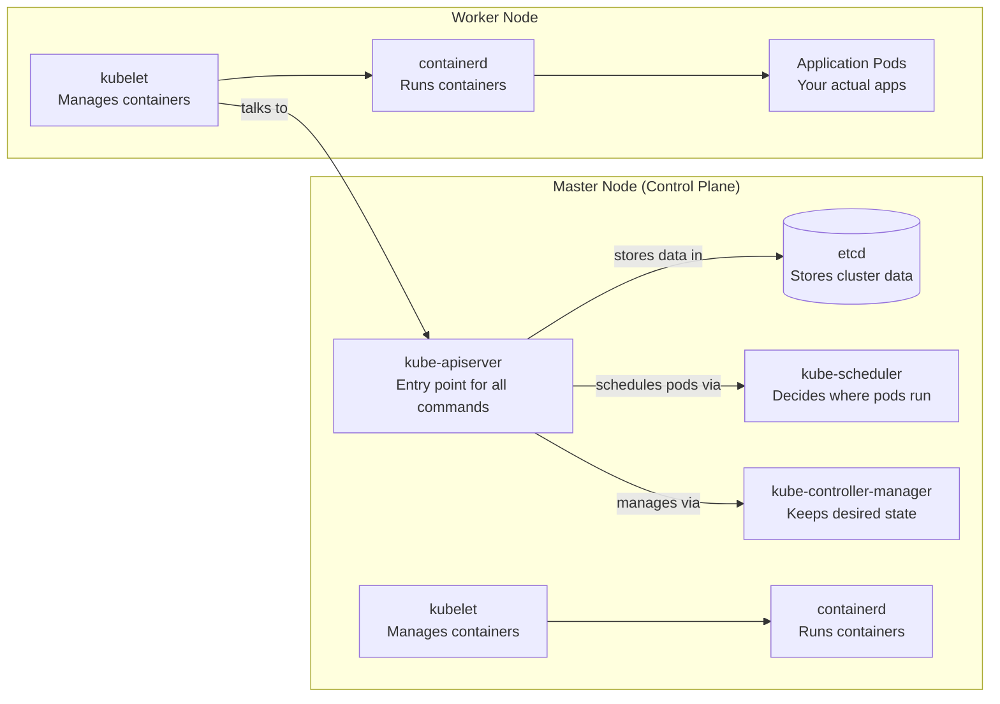

<p align="center">
  
</p>

<h1 align="center">☸️ Getting Started with Kubernetes on AWS</h1>

<p align="center">
  <em>A step-by-step guide to building a production-style two-node Kubernetes cluster on AWS EC2 from scratch.</em>
</p>

<p align="center">
  


</p>

---

## Table of Contents

- [What You Will Build](#what-you-will-build)
- [Cluster Topology](#cluster-topology)
- [Tech Stack](#tech-stack)
- [Prerequisites](#prerequisites)
- [Components & Tools Explained](#components--tools-explained)
- [Architecture Overview](#architecture-overview)
- [Phase 1: AWS Infrastructure Setup](#phase-1-aws-infrastructure-setup)
- [Phase 2: Verify Network Connectivity](#phase-2-verify-network-connectivity)
- [Phase 3: Clean Installation (If Rebuilding)](#phase-3-clean-installation-if-rebuilding)
- [Phase 4: Install & Configure containerd](#phase-4-install--configure-containerd)
- [Phase 5: Install Kubernetes Components](#phase-5-install-kubernetes-components)
- [Phase 6: Pre-Flight Checks (Master Only)](#phase-6-pre-flight-checks-master-only)
- [Phase 7: Initialize the Control Plane](#phase-7-initialize-the-control-plane)
- [Phase 8: Install the CNI Plugin (Flannel)](#phase-8-install-the-cni-plugin-flannel)
- [Phase 9: Join the Worker Node](#phase-9-join-the-worker-node)
- [Phase 10: Final Validation](#phase-10-final-validation)
- [Handy Commands Reference](#handy-commands-reference)
- [Troubleshooting](#troubleshooting)

---

This guide walks you through every phase — from provisioning infrastructure to a healthy, running cluster — with beginner-friendly explanations at each step.

<a id="what-you-will-build"></a>
## 🎯 What You Will Build

By the end of this guide, you will have:

- ✅ Two Ubuntu EC2 instances configured as a Kubernetes **master** (control plane) and **worker** node
- ✅ **containerd** installed and configured as the container runtime
- ✅ **Kubernetes v1.34.x** installed via the official repository
- ✅ **Flannel** CNI plugin for pod networking
- ✅ A fully functional cluster where both nodes report `Ready` status

<a id="cluster-topology"></a>
## 🗺️ Cluster Topology

| Role                   | Hostname | Private IP            | Public IP            |
| ---------------------- | -------- | --------------------- | -------------------- |
| Control Plane (Master) | master   | `<MASTER_PRIVATE_IP>` | `<MASTER_PUBLIC_IP>` |
| Worker                 | worker   | `<WORKER_PRIVATE_IP>` | `<WORKER_PUBLIC_IP>` |

> **Note:** Replace all placeholder IPs (`<MASTER_PRIVATE_IP>`, `<WORKER_PRIVATE_IP>`, etc.) with your actual EC2 instance IPs throughout this guide.

<a id="tech-stack"></a>
## 🛠️ Tech Stack

| Component         | Version          |
| ----------------- | ---------------- |
| OS                | Ubuntu 26.04 LTS |
| Container Runtime | containerd 2.2.x |
| Kubernetes        | v1.34.x          |
| CNI Plugin        | Flannel          |

---

<a id="prerequisites"></a>
## 📋 Prerequisites

Before you begin, make sure you have the following:

### AWS Requirements

- An **AWS account** with permissions to create EC2 instances and Security Groups
- **Two EC2 instances** (t3.medium or higher recommended) in the same VPC/subnet
- A **SSH key pair** (`.pem` file) for connecting to your instances
- The security group must allow the network traffic listed in [Phase 1](#phase-1-aws-infrastructure-setup)

### Knowledge Assumptions

- Basic familiarity with the **Linux command line** (navigating directories, running commands, editing files)
- Understanding of basic **networking concepts** (IP addresses, ports, protocols)
- An **SSH client** installed on your local machine (Terminal on macOS/Linux, PuTTY or MobaXterm on Windows)

### Software on Your Local Machine

- `ssh` client (built-in on macOS and Linux)
- A text editor for configuration files

---

<a id="components--tools-explained"></a>
## 🧩 Components & Tools Explained

This tutorial uses several tools and components. The table below explains each one so you understand what you are installing and why.

|                                                                                                                          | Tool / Component                      | Purpose in This Tutorial                       | Beginner Explanation                                                                                                  |
| ------------------------------------------------------------------------------------------------------------------------ | ------------------------------------- | ---------------------------------------------- | --------------------------------------------------------------------------------------------------------------------- |
|  | **AWS EC2**                           | Hosts the master and worker nodes              | Virtual machines in the cloud that run your Kubernetes cluster                                                        |
|                                                                                                                          | **Security Group**                    | Controls network traffic to/from EC2 instances | A cloud firewall that defines which ports and IPs are allowed to communicate with your servers                        |
|                                      | **containerd**                        | Container runtime for Kubernetes               | The software that actually runs containers (isolated processes). Kubernetes delegates container management to it      |
|             | **kubeadm**                           | Bootstraps the Kubernetes cluster              | A command-line tool that sets up the Kubernetes control plane and joins nodes to the cluster                          |
|             | **kubelet**                           | Manages containers on each node                | An agent running on every node that ensures containers described in Kubernetes configurations are running and healthy |
|             | **kubectl**                           | Interacts with the Kubernetes cluster          | The primary command-line tool for talking to the Kubernetes API server — deploying apps, checking status, debugging   |
|                                                                                                                          | **Flannel**                           | Provides pod networking (CNI)                  | A networking plugin that gives every pod a unique IP address and enables pods on different nodes to communicate       |
|                                                                                                                          | **CNI (Container Network Interface)** | Standard for pod networking                    | A specification that defines how networking plugins (like Flannel) integrate with Kubernetes                          |
|                                                                                                                          | **etcd**                              | Stores cluster state                           | A distributed key-value database that holds all cluster data — configurations, secrets, node states                   |
|                                                                                                                          | **CoreDNS**                           | DNS resolution for services                    | Provides DNS-based service discovery so pods can find each other by name                                              |
|             | **kubeadm init**                      | Initializes the control plane                  | The command that sets up the API server, etcd, scheduler, and controller manager on the master node                   |
|             | **kubeadm join**                      | Adds a worker to the cluster                   | The command a worker node runs to register itself with the control plane                                              |
|                                                                                                                          | **NodePort**                          | Exposes services on a static port              | A Kubernetes service type that makes a service accessible on a specific port (30000-32767) on every node's IP         |

---

<a id="architecture-overview"></a>
## 🏛️ Architecture Overview

Below is a simplified view of the two-node Kubernetes cluster. The master manages the cluster, and the worker runs your applications.



**How it works:**

1. **Master node** — Runs the control plane (API server, etcd, scheduler, controller manager). It makes decisions about your cluster but does not run your application pods.
2. **Worker node** — Runs your actual application pods. The kubelet on the worker communicates with the master's API server.
3. **containerd** — On both nodes, this is the container runtime that actually starts and stops containers.
4. **Flannel** — (installed in Phase 8) Creates a virtual network so pods on different nodes can communicate with each other.

---

<a id="phase-1-aws-infrastructure-setup"></a>
# Phase 1: ☁️ AWS Infrastructure Setup

<p align="center">
  
</p>

## Create EC2 Instances

Launch two Ubuntu 26.04 LTS EC2 instances in the same VPC and subnet:

1. Go to the **AWS EC2 Console** → **Instances** → **Launch Instance**
2. Select **Ubuntu 26.04 LTS** as the AMI
3. Choose **t3.medium** (or higher) for instance type
4. Select your existing **key pair** (or create a new one)
5. Under **Network settings**, select your default VPC and subnet
6. Select the security group you will create below
7. Launch two instances and name them `master` and `worker`

> **Important:** Both instances must be in the same VPC/subnet (or routed subnets) so they can communicate over private IPs.

## Configure Security Groups

Create or modify a security group with the following rules. This security group acts as a firewall for your Kubernetes nodes.

### Inbound Rules

These rules control what traffic is allowed **into** your instances.

| Service            | Protocol | Port        | Source                         | Why This Rule Exists                                                                              |
| ------------------ | -------- | ----------- | ------------------------------ | ------------------------------------------------------------------------------------------------- |
| SSH                | TCP      | 22          | **Your Public IP** (preferred) | Allows you to connect to the instance via SSH. Restricting to your IP is a security best practice |
| HTTP               | TCP      | 80          | `0.0.0.0/0`                    | Allows web traffic if you expose services on port 80                                              |
| HTTPS              | TCP      | 443         | `0.0.0.0/0`                    | Allows secure web traffic                                                                         |
| Kubernetes API     | TCP      | 6443        | **This Security Group**        | The API server must be reachable by all nodes in the cluster for communication                    |
| etcd               | TCP      | 2379-2380   | **This Security Group**        | etcd client and peer communication between control plane components                               |
| Kubelet            | TCP      | 10250       | **This Security Group**        | Allows the API server to communicate with kubelet on each node                                    |
| Controller Manager | TCP      | 10257       | **This Security Group**        | Control plane internal communication                                                              |
| Scheduler          | TCP      | 10259       | **This Security Group**        | Control plane internal communication                                                              |
| Flannel VXLAN      | UDP      | 8472        | **This Security Group**        | Flannel uses VXLAN encapsulation for pod-to-pod networking across nodes                           |
| NodePort           | TCP      | 30000-32767 | `0.0.0.0/0`                    | Allows external access to Kubernetes NodePort services                                            |
| All TCP            | TCP      | All         | **This Security Group**        | Ensures all internal TCP traffic between cluster nodes is allowed                                 |
| All UDP            | UDP      | All         | **This Security Group**        | Ensures all internal UDP traffic between cluster nodes is allowed                                 |
| All ICMP           | ICMP     | All         | **This Security Group**        | Allows ping and other ICMP traffic for diagnostics                                                |

> **Key concept:** Rules with source **"This Security Group"** mean only other instances using the same security group can reach those ports. This keeps cluster traffic internal.

### Outbound Rules

Keep the AWS default — allow all outbound traffic:

| Type        | Protocol | Port | Destination |
| ----------- | -------- | ---- | ----------- |
| All Traffic | All      | All  | `0.0.0.0/0` |

---

<a id="phase-2-verify-network-connectivity"></a>
# Phase 2: 🔍 Verify Network Connectivity

Before installing anything, verify that the two instances can communicate with each other over the private network.

### Test SSH Connectivity

From the **master** node, test SSH to the worker:

```bash
nc -zv <WORKER_PRIVATE_IP> 22
```

From the **worker** node, test SSH to the master:

```bash
nc -zv <MASTER_PRIVATE_IP> 22
```

If `nc` (netcat) is not installed, install it first:

```bash
sudo apt update
sudo apt install -y netcat-openbsd
```

| Command          | What It Does                                           | Why It Is Needed                                                             |
| ---------------- | ------------------------------------------------------ | ---------------------------------------------------------------------------- |
| `nc -zv <IP> 22` | Tests TCP connection to port 22 (SSH) on the target IP | Verifies that the security group and network routing allow SSH between nodes |

### Test Ping Connectivity

From the **master** node:

```bash
ping <WORKER_PRIVATE_IP>
```

From the **worker** node:

```bash
ping <MASTER_PRIVATE_IP>
```

> Both SSH and ping must succeed before proceeding. If they fail, check your Security Group rules and verify both instances are in the same VPC/subnet.

---

<a id="phase-3-clean-installation-if-rebuilding"></a>
# Phase 3: 🧹 Clean Installation (If Rebuilding)

> **Skip this phase** if you are installing Kubernetes on fresh instances for the first time. Only follow these steps if you previously ran `kubeadm init` and need to start over.

Run **every command on BOTH the master and the worker**.

### Step 3.1 — Reset Kubernetes

```bash
sudo kubeadm reset -f
```

| Command            | What It Does                                                                                                      |
| ------------------ | ----------------------------------------------------------------------------------------------------------------- |
| `kubeadm reset -f` | Undoes all `kubeadm init` and `kubeadm join` changes — removes certificates, etcd data, and cluster configuration |

### Step 3.2 — Stop Services

```bash
sudo systemctl stop kubelet
sudo systemctl stop containerd
sudo systemctl stop docker 2>/dev/null
```

The `2>/dev/null` on the docker command suppresses an error if docker is not installed — this is normal.

### Step 3.3 — Remove Kubernetes Packages

```bash
sudo apt purge -y kubeadm kubelet kubectl kubernetes-cni
sudo apt autoremove -y
```

| Command          | What It Does                                         |
| ---------------- | ---------------------------------------------------- |
| `apt purge`      | Removes the packages and their configuration files   |
| `apt autoremove` | Cleans up any dependencies that are no longer needed |

### Step 3.4 — Remove Kubernetes Directories

```bash
sudo rm -rf /etc/kubernetes
sudo rm -rf /var/lib/etcd
sudo rm -rf /var/lib/kubelet
sudo rm -rf /etc/cni
sudo rm -rf /opt/cni
sudo rm -rf /var/lib/cni
sudo rm -rf ~/.kube
```

These directories contain all Kubernetes configuration, certificates, etcd data, and CNI plugin files. Removing them ensures a truly clean slate.

### Step 3.5 — Remove Containerd Configuration

```bash
sudo rm -rf /etc/containerd
```

> **Do not uninstall containerd itself.** You will reconfigure it in Phase 4.

### Step 3.6 — Flush Networking Rules

```bash
sudo iptables -F
sudo iptables -t nat -F
sudo iptables -t mangle -F
sudo iptables -X
```

| Command                 | What It Does                                        |
| ----------------------- | --------------------------------------------------- |
| `iptables -F`           | Flushes (clears) all firewall rules                 |
| `iptables -t nat -F`    | Flushes all NAT (Network Address Translation) rules |
| `iptables -t mangle -F` | Flushes all packet mangling rules                   |
| `iptables -X`           | Deletes all custom chains                           |

### Step 3.7 — Verify Cleanup

Run these commands on **both** nodes:

```bash
which kubeadm
which kubelet
which kubectl
ls /etc/kubernetes
```

**Expected output:**

- `which kubeadm` → no output (command not found)
- `which kubelet` → no output (command not found)
- `which kubectl` → no output (command not found)
- `ls /etc/kubernetes` → `ls: cannot access '/etc/kubernetes': No such file or directory`

If you see these results, the cleanup is complete. Proceed to Phase 4.

---

<a id="phase-4-install--configure-containerd"></a>
# Phase 4: 📦 Install & Configure containerd

<p align="center">
  
</p>

**containerd** is the container runtime that Kubernetes uses to run containers. It is the industry-standard runtime recommended by the Kubernetes project.

> **Run every command on BOTH the master and the worker.**

### Step 4.1 — Update Ubuntu

```bash
sudo apt update
sudo apt upgrade -y
```

> This may take a few minutes depending on your instance.

### Step 4.2 — Verify Swap Is Disabled

Kubernetes requires swap to be disabled. Check with:

```bash
free -h
```

**Expected output (the Swap row should show all zeros):**

```
Swap:            0B          0B          0B
```

If swap is already `0B`, you are good. If not, disable it:

```bash
sudo swapoff -a
sudo sed -i '/ swap / s/^\(.*\)$/#\1/g' /etc/fstab
```

### Step 4.3 — Load Required Kernel Modules

Kubernetes needs the `overlay` and `br_netfilter` kernel modules for container networking.

Create the configuration file:

```bash
cat <<EOF | sudo tee /etc/modules-load.d/k8s.conf
overlay
br_netfilter
EOF
```

Load them immediately:

```bash
sudo modprobe overlay
sudo modprobe br_netfilter
```

Verify they are loaded:

```bash
lsmod | grep overlay
lsmod | grep br_netfilter
```

Both commands should return output showing the modules are active.

| Module         | What It Does                                                                                            |
| -------------- | ------------------------------------------------------------------------------------------------------- |
| `overlay`      | Enables the OverlayFS filesystem, used by containerd for container image layers                         |
| `br_netfilter` | Enables bridge netfilter, which allows iptables to filter traffic on network bridges used by containers |

### Step 4.4 — Configure Kernel Parameters

These settings enable IP forwarding and bridge netfilter, which are required for pod networking.

```bash
cat <<EOF | sudo tee /etc/sysctl.d/k8s.conf
net.bridge.bridge-nf-call-iptables = 1
net.bridge.bridge-nf-call-ip6tables = 1
net.ipv4.ip_forward = 1
EOF
```

Apply the changes:

```bash
sudo sysctl --system
```

Verify:

```bash
sysctl net.ipv4.ip_forward
```

**Expected output:**

```
net.ipv4.ip_forward = 1
```

| Parameter                                | What It Does                                                                                           |
| ---------------------------------------- | ------------------------------------------------------------------------------------------------------ |
| `net.bridge.bridge-nf-call-iptables = 1` | Allows iptables to see traffic traversing network bridges (needed for kube-proxy)                      |
| `net.ipv4.ip_forward = 1`                | Enables the kernel to route packets between network interfaces (required for pod-to-pod communication) |

### Step 4.5 — Install containerd

```bash
sudo apt install -y containerd
```

Verify the installation:

```bash
containerd --version
```

### Step 4.6 — Generate the Default Configuration

```bash
sudo mkdir -p /etc/containerd
containerd config default | sudo tee /etc/containerd/config.toml
```

This creates the default containerd configuration file at `/etc/containerd/config.toml`.

### Step 4.7 — Enable the systemd Cgroup Driver

This is one of the **most common causes of Kubernetes installation failures** if not configured correctly.

Open the configuration file:

```bash
sudo nano /etc/containerd/config.toml
```

Find this line:

```
SystemdCgroup = false
```

Change it to:

```
SystemdCgroup = true
```

Save and exit (in nano: `Ctrl+O`, `Enter`, `Ctrl+X`).

> **Why this matters:** Kubernetes uses systemd to manage cgroups (resource isolation). If containerd does not use the systemd cgroup driver, you will see errors like `failed to create kubelet: cgroup driver systemd is different from cgroup driver ""`.

### Step 4.8 — Restart and Enable containerd

```bash
sudo systemctl restart containerd
sudo systemctl enable containerd
```

Check the status:

```bash
sudo systemctl status containerd
```

You should see:

```
Active: active (running)
```

---

<a id="phase-5-install-kubernetes-components"></a>
# Phase 5: ⚙️ Install Kubernetes Components

This phase installs `kubeadm`, `kubelet`, and `kubectl` from the official Kubernetes repository.

> **Run all commands on BOTH the master and the worker.**

### Step 5.1 — Install Required Packages

```bash
sudo apt-get update
sudo apt-get install -y apt-transport-https ca-certificates curl gpg
```

| Package               | What It Does                                     |
| --------------------- | ------------------------------------------------ |
| `apt-transport-https` | Allows apt to use HTTPS repositories             |
| `ca-certificates`     | Installs CA certificates for secure connections  |
| `curl`                | Used to download the Kubernetes GPG key          |
| `gpg`                 | Used to manage GPG keys for package verification |

### Step 5.2 — Create the Keyring Directory

```bash
sudo mkdir -p /etc/apt/keyrings
```

### Step 5.3 — Add the Kubernetes GPG Key

```bash
curl -fsSL https://pkgs.k8s.io/core:/stable:/v1.34/deb/Release.key | sudo gpg --dearmor -o /etc/apt/keyrings/kubernetes-apt-keyring.gpg
```

This downloads the GPG key used to verify the authenticity of Kubernetes packages.

### Step 5.4 — Add the Kubernetes Repository

```bash
echo 'deb [signed-by=/etc/apt/keyrings/kubernetes-apt-keyring.gpg] https://pkgs.k8s.io/core:/stable:/v1.34/deb/ /' | sudo tee /etc/apt/sources.list.d/kubernetes.list
```

### Step 5.5 — Update APT and Install Kubernetes

```bash
sudo apt update
sudo apt install -y kubelet kubeadm kubectl
```

| Component | What It Does                                                        |
| --------- | ------------------------------------------------------------------- |
| `kubeadm` | Bootstraps and manages the Kubernetes cluster (init, join, upgrade) |
| `kubelet` | The node agent that ensures containers are running as specified     |
| `kubectl` | The CLI tool for interacting with the Kubernetes API                |

### Step 5.6 — Prevent Automatic Upgrades

```bash
sudo apt-mark hold kubelet kubeadm kubectl
```

This prevents `apt upgrade` from unexpectedly upgrading Kubernetes to a newer version, which could break your cluster.

### Step 5.7 — Enable the Kubelet

```bash
sudo systemctl enable kubelet
```

> **Note:** It is normal if the kubelet is not fully running yet. It will not be healthy until the control plane is initialized in Phase 7.

### Step 5.8 — Verify the Installation

Run these commands on **both** nodes:

```bash
kubeadm version
kubelet --version
kubectl version --client
```

All three should return version information. If `crictl` is not installed, you can install it:

```bash
sudo apt install -y crictl
```

---

<a id="phase-6-pre-flight-checks-master-only"></a>
# Phase 6: ✅ Pre-Flight Checks (Master Only)

Before initializing the control plane, run these checks **on the master node only** to catch issues early.

### 6.1 — Verify containerd Is Running

```bash
sudo systemctl status containerd --no-pager
```

**Expected:** `Active: active (running)`

### 6.2 — Verify kubelet Status

```bash
sudo systemctl status kubelet --no-pager
```

It is **normal** to see `activating (auto-restart)` or `failed` at this stage. The kubelet has not been configured by `kubeadm` yet, so it may restart repeatedly. This is expected behavior.

### 6.3 — Verify cgroup Configuration

```bash
grep SystemdCgroup /etc/containerd/config.toml
```

**Expected:** `SystemdCgroup = true`

### 6.4 — Verify IP Forwarding

```bash
sysctl net.ipv4.ip_forward
```

**Expected:** `net.ipv4.ip_forward = 1`

### 6.5 — Verify Kubernetes Version

```bash
kubeadm version
```

### Pre-Flight Checklist

| Check                | Expected Result                 |
| -------------------- | ------------------------------- |
| containerd running   | `Active: active (running)`      |
| SystemdCgroup        | `true`                          |
| IP forwarding        | `1`                             |
| Kubernetes installed | Version number displayed        |
| Network connectivity | SSH and ping work between nodes |

> If all checks pass, you are ready to initialize the control plane.

---

<a id="phase-7-initialize-the-control-plane"></a>
# Phase 7: 🚀 Initialize the Control Plane

This is the most critical step. The control plane consists of the API server, etcd, scheduler, and controller manager.

> **Run this ONLY on the master node.**

### Step 7.1 — Run kubeadm init

```bash
sudo kubeadm init \
  --apiserver-advertise-address=<MASTER_PRIVATE_IP> \
  --pod-network-cidr=10.244.0.0/16 \
  --node-name=master \
  --cri-socket=unix:///run/containerd/containerd.sock
```

| Flag                            | What It Does                                                                                                     |
| ------------------------------- | ---------------------------------------------------------------------------------------------------------------- |
| `--apiserver-advertise-address` | The IP address the API server advertises to the cluster. Use the master's private IP                             |
| `--pod-network-cidr`            | The IP range for pod networking. `10.244.0.0/16` is the default for Flannel                                      |
| `--node-name`                   | The name assigned to this node in the cluster                                                                    |
| `--cri-socket`                  | Explicitly specifies the container runtime socket. Prevents auto-detection issues with newer containerd versions |

> **If `kubeadm init` fails:** Copy the last 20-30 lines of the error output. Common causes include incorrect cgroup driver, swap not disabled, or network connectivity issues.

### Step 7.2 — Configure kubectl

After a successful `kubeadm init`, run these commands on the **master** to set up `kubectl` access:

```bash
mkdir -p $HOME/.kube
sudo cp -i /etc/kubernetes/admin.conf $HOME/.kube/config
sudo chown $(id -u):$(id -g) $HOME/.kube/config
```

| Command                                               | What It Does                                                           |
| ----------------------------------------------------- | ---------------------------------------------------------------------- |
| `mkdir -p $HOME/.kube`                                | Creates the `.kube` directory if it does not exist                     |
| `cp -i /etc/kubernetes/admin.conf $HOME/.kube/config` | Copies the cluster admin configuration to your home directory          |
| `chown $(id -u):$(id -g) $HOME/.kube/config`          | Sets file ownership to your current user so kubectl works without sudo |

### Step 7.3 — Verify the Node

```bash
kubectl get nodes
```

**Expected output:**

```
NAME      STATUS     ROLES           AGE   VERSION
master    NotReady   control-plane   ...   v1.34.9
```

> **`NotReady` is expected** at this stage. The node will not become `Ready` until you install the CNI plugin (Flannel) in Phase 8.

---

<a id="phase-8-install-the-cni-plugin-flannel"></a>
# Phase 8: 🌐 Install the CNI Plugin (Flannel)

**Flannel** is a simple and reliable CNI (Container Network Interface) plugin. It creates a virtual network that gives every pod a unique IP address and enables cross-node pod communication.

> **Run this ONLY on the master node.**

### Step 8.1 — Verify the Current State

```bash
kubectl get nodes
```

Expected: master shows `NotReady` (no pod network yet).

### Step 8.2 — Install Flannel

```bash
kubectl apply -f https://github.com/flannel-io/flannel/releases/latest/download/kube-flannel.yml
```

This deploys Flannel as a DaemonSet, meaning one Flannel pod runs on every node in the cluster.

### Step 8.3 — Wait for Flannel to Start

Watch the Flannel pods:

```bash
kubectl get pods -n kube-flannel -w
```

Wait until the Flannel pod shows `Running` status. This usually takes 1-2 minutes. Press `Ctrl+C` to stop watching once it is ready.

### Step 8.4 — Verify All System Pods

```bash
kubectl get pods -A
```

You should see pods like:

| Pod                              | Namespace    | Purpose                     |
| -------------------------------- | ------------ | --------------------------- |
| `etcd-master`                    | kube-system  | Distributed key-value store |
| `kube-apiserver-master`          | kube-system  | Kubernetes API server       |
| `kube-controller-manager-master` | kube-system  | Runs controller loops       |
| `kube-scheduler-master`          | kube-system  | Schedules pods onto nodes   |
| `coredns-*`                      | kube-system  | DNS resolution for services |
| `kube-flannel-*`                 | kube-flannel | Pod networking              |

All pods should eventually reach `Running` status.

### Step 8.5 — Verify the Node Status

```bash
kubectl get nodes
```

**Expected output:**

```
NAME      STATUS   ROLES           AGE   VERSION
master    Ready    control-plane   ...   v1.34.9
```

The status should change from **NotReady** to **Ready** after Flannel is running.

---

<a id="phase-9-join-the-worker-node"></a>
# Phase 9: 🔗 Join the Worker Node

Now that the master is healthy, you can join the worker node to the cluster.

### Step 9.1 — Generate the Join Command (On Master)

```bash
kubeadm token create --print-join-command
```

This outputs a command like:

```
kubeadm join <MASTER_PRIVATE_IP>:6443 \
  --token abcdef.1234567890abcdef \
  --discovery-token-ca-cert-hash sha256:xxxxxxxx
```

### Step 9.2 — Run the Join Command (On Worker)

Copy the full command from Step 9.1, append the CRI socket flag, and run it on the **worker** node:

```bash
sudo kubeadm join <MASTER_PRIVATE_IP>:6443 \
  --token <your-token> \
  --discovery-token-ca-cert-hash sha256:<your-hash> \
  --cri-socket unix:///run/containerd/containerd.sock
```

| Flag                             | What It Does                                                       |
| -------------------------------- | ------------------------------------------------------------------ |
| `--token`                        | Authentication token generated by the master to authorize the join |
| `--discovery-token-ca-cert-hash` | Verifies the CA certificate of the API server for secure discovery |
| `--cri-socket`                   | Specifies the container runtime socket on the worker node          |

### Step 9.3 — Verify the Cluster (On Master)

After the join completes successfully, go back to the **master** and run:

```bash
kubectl get nodes -o wide
```

**Expected output:**

```
NAME     STATUS   ROLES           AGE   VERSION
master   Ready    control-plane   ...   v1.34.9
worker   Ready    <none>          ...   v1.34.9
```

Both nodes should show `Ready` status.

---

<a id="phase-10-final-validation"></a>
# Phase 10: 🎉 Final Validation

Run these commands on the **master** to confirm the cluster is fully operational.

### Check Nodes

```bash
kubectl get nodes -o wide
```

Both nodes should be `Ready`.

### Check All Pods

```bash
kubectl get pods -A -o wide
```

All system pods should be `Running`.

### Check Cluster Info

```bash
kubectl cluster-info
```

This shows the API server and CoreDNS endpoints.

### Healthy Cluster Checklist

| Component          | Expected Status |
| ------------------ | --------------- |
| Both nodes         | `Ready`         |
| CoreDNS            | Running         |
| Flannel            | Running         |
| API Server         | Running         |
| etcd               | Running         |
| Controller Manager | Running         |
| Scheduler          | Running         |

> If all items check out, your Kubernetes cluster is fully operational.

---

<a id="handy-commands-reference"></a>
# 📖 Handy Commands Reference

## Nodes

```bash
kubectl get nodes                    # List all nodes
kubectl describe node master         # Detailed info about master
kubectl top nodes                    # Resource usage (requires metrics-server)
```

## Pods

```bash
kubectl get pods -A                  # List all pods in all namespaces
kubectl describe pod <pod> -n <ns>   # Detailed info about a pod
kubectl logs <pod> -n <ns>           # View pod logs
kubectl delete pod <pod> -n <ns>     # Delete a pod
```

## Namespaces

```bash
kubectl get ns                       # List all namespaces
kubectl create ns demo               # Create a namespace
kubectl delete ns demo               # Delete a namespace
```

## Deployments

```bash
kubectl get deploy -A                # List all deployments
kubectl rollout status deploy/<name> # Check rollout status
kubectl rollout restart deploy/<name># Restart a deployment
```

## Services

```bash
kubectl get svc -A                   # List all services
kubectl describe svc <service>       # Detailed info about a service
```

## Events

```bash
kubectl get events -A --sort-by=.lastTimestamp   # View events sorted by time
```

## Cluster Info

```bash
kubectl cluster-info                 # Show cluster endpoints
kubectl version                      # Show Kubernetes version
kubectl api-resources                # List all resource types
kubectl api-versions                 # List all API versions
```

## Reset (If Needed)

```bash
# Reset worker only
sudo kubeadm reset -f

# Reset master only
sudo kubeadm reset -f
sudo rm -rf ~/.kube
```

---

<a id="troubleshooting"></a>
# 🔧 Troubleshooting

| Problem                           | Possible Cause                                               | Solution                                                                    |
| --------------------------------- | ------------------------------------------------------------ | --------------------------------------------------------------------------- |
| Worker cannot join cluster        | Security Group blocking port 6443                            | Add inbound rule for TCP 6443 from the security group                       |
| Nodes cannot communicate          | Instances in different subnets/VPCs                          | Ensure both instances are in the same VPC and subnet                        |
| Pods stuck in `ContainerCreating` | Flannel not running or containerd misconfigured              | Check `kubectl get pods -A` and `systemctl status containerd`               |
| Node shows `NotReady`             | CNI plugin not installed or kubelet failing                  | Check `kubectl get pods -A` and `systemctl status kubelet`                  |
| `kubeadm init` fails              | Swap enabled, cgroup driver wrong, or containerd not running | Verify swap is off, SystemdCgroup is `true`, and containerd is active       |
| kubelet keeps restarting          | Normal before `kubeadm init` — or misconfiguration after     | Before init: expected. After init: check `journalctl -u kubelet` for errors |
| Cannot access NodePort service    | Security Group missing port range 30000-32767                | Add inbound rule for TCP 30000-32767                                        |
| `kubectl` command not found       | kubectl not installed or not in PATH                         | Reinstall: `sudo apt install -y kubectl` and verify with `which kubectl`    |

---

> **Next Steps:** Once your cluster is running, you can proceed to deploy applications, set up RBAC (Role-Based Access Control), configure monitoring, or integrate with CI/CD tools like Jenkins.
