<p align="center">
  
</p>

<h1 align="center">Complete CI/CD Pipeline with Jenkins, AWS & Kubernetes</h1>

<p align="center">
  <em>A hands-on, beginner-friendly guide to building a production-style CI/CD pipeline from scratch — covering infrastructure setup, source code management, automated testing, security scanning, artifact management, containerization, deployment, and monitoring.</em>
</p>

<p align="center">
  
  &nbsp;&nbsp;
  
  &nbsp;&nbsp;
  
  &nbsp;&nbsp;
  
  &nbsp;&nbsp;
  
  &nbsp;&nbsp;
  
  &nbsp;&nbsp;
  
</p>

---

## Table of Contents

- [Introduction](#introduction)
- [What You Will Build](#what-you-will-build)
- [Pipeline Architecture](#pipeline-architecture)
- [Prerequisites](#prerequisites)
- [Tools, Services & Components](#tools-services--components)
- [AWS Infrastructure Setup](#aws-infrastructure-setup)
- [Phase 1 — Infrastructure Setup](#phase-1--infrastructure-setup)
  - [1.1 Create a Secure Network (VPC)](#11-create-a-secure-network-vpc)
  - [1.2 Configure Security Groups](#12-configure-security-groups)
  - [1.3 Create Kubernetes Cluster VMs](#13-create-kubernetes-cluster-vms)
  - [1.4 Install & Configure Kubernetes Cluster](#14-install--configure-kubernetes-cluster)
  - [1.5 Scan the Kubernetes Cluster (kubeaudit)](#15-scan-the-kubernetes-cluster-kubeaudit)
  - [1.6 Create Tool Server VMs (Jenkins, SonarQube, Nexus)](#16-create-tool-server-vms-jenkins-sonarnexus)
  - [1.7 Install Docker on All Tool Servers](#17-install-docker-on-all-tool-servers)
  - [1.8 Set Up SonarQube](#18-set-up-sonarqube)
  - [1.9 Set Up Nexus](#19-set-up-nexus)
  - [1.10 Set Up Jenkins](#110-set-up-jenkins)
- [Phase 2 — Source Code Management](#phase-2--source-code-management)
- [Phase 3 — CI/CD Pipeline Configuration](#phase-3--cicd-pipeline-configuration)
  - [3.1 Install Jenkins Plugins](#31-install-jenkins-plugins)
  - [3.2 Configure Jenkins Tools](#32-configure-jenkins-tools)
  - [3.3 Create the Jenkins Pipeline](#33-create-the-jenkins-pipeline)
  - [3.4 Pipeline Stages Explained](#34-pipeline-stages-explained)
- [Phase 4 — Kubernetes Deployment Setup](#phase-4--kubernetes-deployment-setup)
  - [4.1 Create a Service Account (RBAC)](#41-create-a-service-account-rbac)
  - [4.2 Generate a Token for Jenkins](#42-generate-a-token-for-jenkins)
  - [4.3 Install kubectl on Jenkins](#43-install-kubectl-on-jenkins)
  - [4.4 Create Deployment & Service Manifests](#44-create-deployment--service-manifests)
  - [4.5 Deploy & Verify](#45-deploy--verify)
- [Phase 5 — Monitoring](#phase-5--monitoring)
  - [5.1 Set Up Prometheus](#51-set-up-prometheus)
  - [5.2 Set Up Grafana](#52-set-up-grafana)
  - [5.3 Set Up Blackbox Exporter](#53-set-up-blackbox-exporter)
  - [5.4 Configure Prometheus to Scrape Targets](#54-configure-prometheus-to-scrape-targets)
  - [5.5 Connect Prometheus to Grafana](#55-connect-prometheus-to-grafana)
  - [5.6 Import a Grafana Dashboard](#56-import-a-grafana-dashboard)
  - [5.7 System-Level Monitoring with Node Exporter](#57-system-level-monitoring-with-node-exporter)
- [Troubleshooting](#troubleshooting)
- [Next Steps](#next-steps)

---

## Introduction

In a real-world corporate environment, shipping code to production is never as simple as running it on your laptop. You need a robust pipeline that automates building, testing, scanning, deploying, and monitoring — all while keeping your infrastructure secure.

This tutorial walks you through **every phase** of building a complete CI/CD pipeline from scratch on AWS. You will:

1. Set up a **secure network** and **Kubernetes cluster** on AWS EC2
2. Create a **private GitHub repository** and push your source code
3. Configure **Jenkins** with all the plugins and tools needed for automation
4. Build a pipeline that **compiles, tests, scans for vulnerabilities, builds Docker images, and deploys to Kubernetes**
5. Set up **Prometheus and Grafana** for application and infrastructure monitoring

No prior DevOps experience is required. Every command and concept is explained with beginner-friendly context.

---

## What You Will Build

By the end of this tutorial, you will have:

- A **private VPC** on AWS with properly configured security groups
- A **3-node Kubernetes cluster** (1 master + 2 workers) on EC2
- **SonarQube** running for code quality analysis
- **Nexus** running as an artifact repository
- **Jenkins** configured with a full CI/CD pipeline
- **Trivy** installed for filesystem and Docker image vulnerability scanning
- **Docker** images built, scanned, and pushed to Docker Hub
- **Kubernetes deployment** with RBAC, service accounts, and LoadBalancer service
- **Prometheus + Grafana** dashboards monitoring both website uptime and system metrics

---

## Pipeline Architecture

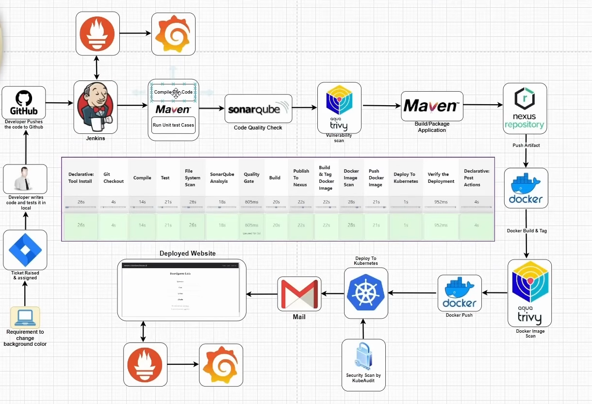

*Complete CI/CD pipeline flow — from source code commit to deployment and monitoring.*

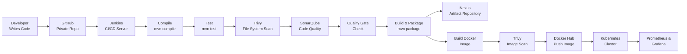
```mermaid
flowchart LR
    DEV[Developer<br/>Writes Code] --> GIT[GitHub<br/>Private Repo]
    GIT --> JENKINS[Jenkins<br/>CI/CD Server]
    JENKINS --> COMPILE[Compile<br/>mvn compile]
    COMPILE --> TEST[Test<br/>mvn test]
    TEST --> TRIVY_FS[Trivy<br/>File System Scan]
    TRIVY_FS --> SONAR[SonarQube<br/>Code Quality]
    SONAR --> QG[Quality Gate<br/>Check]
    QG --> BUILD[Build &amp; Package<br/>mvn package]
    BUILD --> NEXUS[Nexus<br/>Artifact Repository]
    BUILD --> DOCKER[Build Docker<br/>Image]
    DOCKER --> TRIVY_IMG[Trivy<br/>Image Scan]
    TRIVY_IMG --> HUB[Docker Hub<br/>Push Image]
    HUB --> K8S[Kubernetes<br/>Cluster]
    K8S --> MONITOR[Prometheus &amp;<br/>Grafana]
```

**How the pipeline works:**

1. A **developer** writes code and pushes it to a **private GitHub repository**
2. **Jenkins** detects the changes and triggers the pipeline
3. The code is **compiled** and **tested** automatically
4. **Trivy** scans the filesystem for known vulnerabilities in dependencies
5. **SonarQube** analyzes code quality (bugs, code smells, vulnerabilities)
6. A **Quality Gate** check ensures the code meets quality standards before proceeding
7. The application is **packaged** as a JAR file and published to **Nexus**
8. A **Docker image** is built, scanned again with Trivy, and pushed to **Docker Hub**
9. **Jenkins** connects to the **Kubernetes cluster** and deploys the application
10. **Prometheus** and **Grafana** monitor the application's health and performance

---

## Prerequisites

### AWS Requirements

- An **AWS account** with permissions to create EC2 instances, VPCs, and Security Groups
- A **SSH key pair** (`.pem` file) for connecting to your EC2 instances
- A region close to your location (e.g., `ap-south-1` for Mumbai)

### Software on Your Local Machine

| Tool | Purpose | Install |
|------|---------|---------|
| **SSH client** | Connect to EC2 instances | Built-in on macOS/Linux. On Windows, use MobaXterm or PuTTY |
| **Git Bash** | Work with Git repositories from command line | [Download Git for Windows](https://git-scm.com/download/win) |
| **Docker Hub account** | Store container images | [Sign up at hub.docker.com](https://hub.docker.com) |
| **GitHub account** | Host source code | [Sign up at github.com](https://github.com) |

### Knowledge Assumptions

- Basic familiarity with the **Linux command line** (navigating directories, running commands, editing files)
- Understanding of basic **networking concepts** (IP addresses, ports, protocols)
- No prior DevOps, Kubernetes, or Jenkins experience is required — everything is explained step by step

---

## Tools, Services & Components

This tutorial uses many tools. The table below explains each one so you understand what you are installing and why.

| Icon | Tool / Component | Purpose in This Tutorial | Beginner Explanation |
|------|-----------------|--------------------------|----------------------|
|  | **AWS EC2** | Hosts all virtual machines | Virtual servers in the cloud that run your Kubernetes cluster and DevOps tools |
| | **VPC (Virtual Private Cloud)** | Isolates your infrastructure | A private network in AWS that keeps all your resources hidden from the public internet |
| | **Security Group** | Controls network traffic | A cloud firewall that defines which ports and IP addresses can communicate with your servers |
|  | **Kubernetes (K8s)** | Orchestrates container deployments | A platform that manages running your application across multiple servers, handling scaling and self-healing |
| | **kubeadm** | Bootstraps the Kubernetes cluster | A command-line tool that sets up the Kubernetes control plane and joins nodes to the cluster |
| | **kubelet** | Manages containers on each node | An agent running on every node that ensures containers are running and healthy |
| | **kubectl** | Interacts with the Kubernetes cluster | The primary CLI tool for talking to Kubernetes — deploying apps, checking status, debugging |
| | **Flannel** | Provides pod networking | A networking plugin that gives every pod a unique IP and enables cross-node communication |
|  | **Jenkins** | Runs the CI/CD pipeline | An automation server that executes your build, test, scan, and deployment steps automatically |
|  | **Docker** | Builds and runs containers | A tool that packages your application with all its dependencies into a standardized unit called a container |
|  | **SonarQube** | Code quality analysis | A tool that inspects your source code for bugs, vulnerabilities, and code quality issues |
| | **SonarQube Scanner** | Performs the actual analysis | The CLI tool that scans your code and generates a report. It publishes results to the SonarQube server |
|  | **Nexus** | Artifact repository management | A repository that stores your compiled application packages (JARs) so you can manage versions and releases |
|  | **Trivy** | Security vulnerability scanner | A tool that scans your filesystem and Docker images for known security vulnerabilities |
| | **RBAC** | Role-Based Access Control | A security model where you assign permissions based on roles (e.g., admin, developer, read-only) |
|  | **Prometheus** | Metrics collection and alerting | A monitoring system that scrapes (collects) metrics from your applications and infrastructure |
|  | **Grafana** | Monitoring dashboards | A visualization tool that creates beautiful, real-time dashboards from Prometheus data |
| | **Blackbox Exporter** | Website uptime monitoring | A Prometheus exporter that probes your websites from the outside to check if they are up and responding |
| | **Node Exporter** | System metrics monitoring | A Prometheus exporter that reports CPU, RAM, disk, and network usage from your servers |

### EC2 Instances Created in This Tutorial

| Instance Name | Purpose | Instance Type | Storage |
|---------------|---------|---------------|---------|
| **Master** | Kubernetes control plane | t3.medium | 25 GB |
| **Slave-1** | Kubernetes worker node | t3.medium | 25 GB |
| **Slave-2** | Kubernetes worker node | t3.medium | 25 GB |
| **Jenkins** | CI/CD automation server | t2.large (8 GB RAM) | 30 GB |
| **SonarQube** | Code quality server | t2.medium | 20 GB |
| **Nexus** | Artifact repository server | t2.medium | 20 GB |
| **Monitor** | Prometheus, Grafana, exporters | t2.large | 20 GB |

---

## AWS Infrastructure Setup

Before installing any tools, you need a secure network environment. In a corporate setup, all resources are deployed in an isolated network so that no outside entity can access them.

### Create and Configure Your VPC

1. Log in to the **AWS Console** and search for **VPC**
2. You will see a **default VPC** — rename it so you can identify it later
3. The default VPC is sufficient for this tutorial; no changes are needed to its configuration

> **Tip:** In a production environment, you would create a custom VPC with private and public subnets. For learning purposes, the default VPC works well.

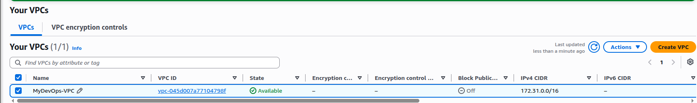

*The AWS VPC dashboard showing the default VPC.*

---

## Phase 1 — Infrastructure Setup

### 1.1 Create a Secure Network (VPC)

As explained above, ensure you have your VPC ready. All EC2 instances in this tutorial will be launched within this VPC so they can communicate over private IPs.

### 1.2 Configure Security Groups

A **Security Group** acts as a virtual firewall for your EC2 instances. You need to open specific ports so that your tools can communicate with each other.

Go to **EC2 > Security Groups** and modify the default security group (or create a new one) with the following **inbound rules**:

| Service | Protocol | Port | Source | Why It Is Needed |
|---------|----------|------|--------|------------------|
| SSH | TCP | 22 | Your IP or `0.0.0.0/0` | Connect to instances via terminal |
| HTTP | TCP | 80 | `0.0.0.0/0` | Web traffic |
| HTTPS | TCP | 443 | `0.0.0.0/0` | Secure web traffic |
| Kubernetes API | TCP | 6443 | Security Group itself | Kubernetes cluster communication |
| NodePort Range | TCP | 30000–32767 | `0.0.0.0/0` | Access deployed applications externally |
| Application Range | TCP | 3000–10000 | `0.0.0.0/0` | Access Jenkins (8080), SonarQube (9000), Nexus (8081), Grafana (3000) |
| SMTPS | TCP | 465 | `0.0.0.0/0` | Email notifications from Jenkins via Gmail |
| All TCP | TCP | All | Security Group itself | Internal cluster communication |
| All UDP | UDP | All | Security Group itself | Internal cluster communication |
| All ICMP | ICMP | All | Security Group itself | Network diagnostics (ping) |

> **Key concept:** Rules with source set to **"This Security Group"** mean only other instances using the same security group can reach those ports. This keeps cluster traffic internal.

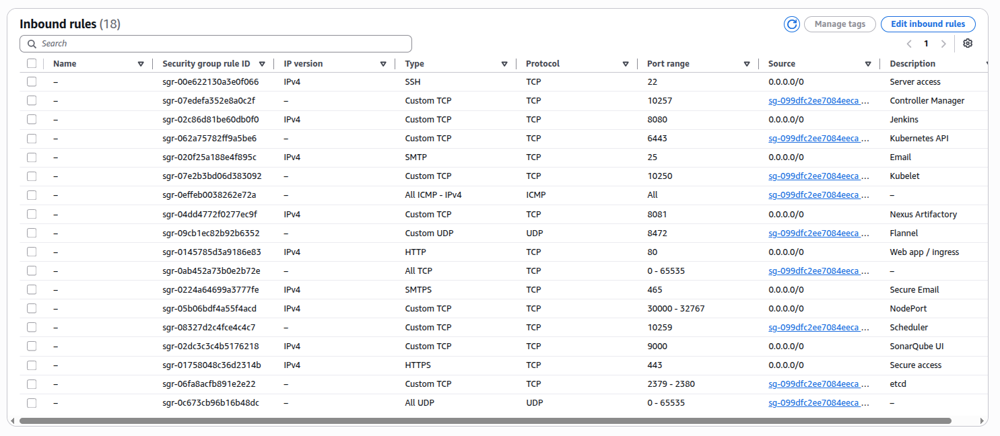

*Security group inbound rules configuration.*

### 1.3 Create Kubernetes Cluster VMs

Create **three EC2 instances** for your Kubernetes cluster:

1. Go to **EC2 > Instances > Launch Instance**
2. Select **Ubuntu 26.04 LTS** as the AMI
3. Choose **t3.medium** as the instance type
4. Select your existing key pair (or create a new one)
5. Under **Network settings**, select your VPC and the security group configured above
6. Set storage to **25 GB**
7. Launch **3 instances** and name them:

| Instance | Role |
|----------|------|
| **Master** | Kubernetes control plane node |
| **Slave-1** | Kubernetes worker node |
| **Slave-2** | Kubernetes worker node |

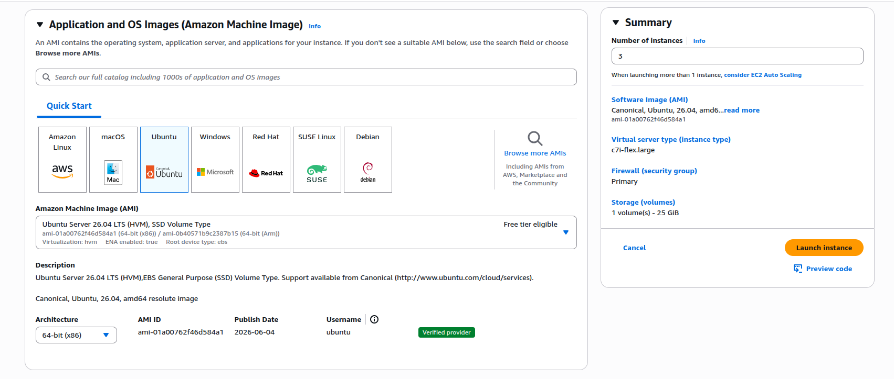

*Launching EC2 instances for the Kubernetes cluster.*

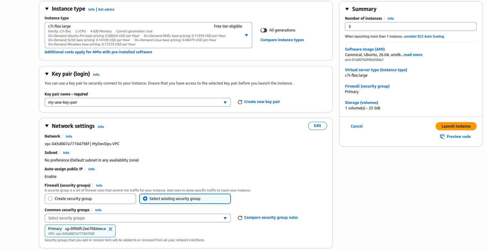

*Instance configuration before launch.*

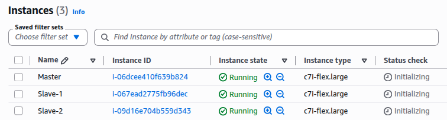

*All three Kubernetes cluster instances running.*

### 1.4 Install & Configure Kubernetes Cluster

Connect to each instance using SSH. You can use your terminal or an SSH tool like **MobaXterm** (Windows) or **Asbru** (Linux).

**Connect via terminal:**

```bash
# Set correct permissions on your key file (required once)
chmod 400 /path/to/your-keypair.pem

# Connect to the master node
ssh -i /path/to/your-keypair.pem ubuntu@<MASTER_PUBLIC_IP>
```

> **Note:** The username is `ubuntu` because we selected Ubuntu as the AMI. For Amazon Linux, the username would be `ec2-user`.

Once connected, switch to root user on **all three machines**:

```bash
sudo su
```

#### Step 1: Update and Install Prerequisites (All Nodes)

Run these commands on **all three machines** (Master, Slave-1, Slave-2):

```bash
# Update package lists
sudo apt update

# Install kubeadm, kubelet, and kubectl
sudo apt-get install -y apt-transport-https ca-certificates curl gpg

# Add Kubernetes GPG key
curl -fsSL https://pkgs.k8s.io/core:/stable:/v1.34/deb/Release.key | sudo gpg --dearmor -o /etc/apt/keyrings/kubernetes-apt-keyring.gpg

# Add Kubernetes repository
echo 'deb [signed-by=/etc/apt/keyrings/kubernetes-apt-keyring.gpg] https://pkgs.k8s.io/core:/stable:/v1.34/deb/ /' | sudo tee /etc/apt/sources.list.d/kubernetes.list

# Install Kubernetes components
sudo apt update
sudo apt install -y kubelet kubeadm kubectl

# Prevent automatic upgrades
sudo apt-mark hold kubelet kubeadm kubectl
```

> **Tip:** To save time, you can create a shell script file (e.g., `setup.sh`), paste all commands into it, make it executable with `chmod +x setup.sh`, and run it with `./setup.sh`.

#### Step 2: Disable Swap (All Nodes)

Kubernetes requires swap to be disabled:

```bash
sudo swapoff -a
sudo sed -i '/ swap / s/^\(.*\)$/#\1/g' /etc/fstab
```

#### Step 3: Load Kernel Modules (All Nodes)

```bash
cat <<EOF | sudo tee /etc/modules-load.d/k8s.conf
overlay
br_netfilter
EOF

sudo modprobe overlay
sudo modprobe br_netfilter
```

#### Step 4: Configure Network Parameters (All Nodes)

```bash
cat <<EOF | sudo tee /etc/sysctl.d/k8s.conf
net.bridge.bridge-nf-call-iptables = 1
net.bridge.bridge-nf-call-ip6tables = 1
net.ipv4.ip_forward = 1
EOF

sudo sysctl --system
```

#### Step 5: Initialize the Control Plane (Master Only)

Run this command **only on the Master node**:

```bash
sudo kubeadm init --pod-network-cidr=10.244.0.0/16
```

| Flag | What It Does |
|------|-------------|
| `--pod-network-cidr` | Defines the IP range for pod networking. `10.244.0.0/16` is the default for Flannel |

After a successful init, configure `kubectl` access:

```bash
mkdir -p $HOME/.kube
sudo cp -i /etc/kubernetes/admin.conf $HOME/.kube/config
sudo chown $(id -u):$(id -g) $HOME/.kube/config
```

#### Step 6: Install Flannel CNI Plugin (Master Only)

```bash
kubectl apply -f https://github.com/flannel-io/flannel/releases/latest/download/kube-flannel.yml
```

Wait for Flannel pods to become `Running`:

```bash
kubectl get pods -n kube-flannel -w
```

Press `Ctrl+C` once the pods are running.

#### Step 7: Join Worker Nodes (Slave-1 and Slave-2)

After `kubeadm init` completes, it outputs a **join command**. Copy that command and run it on both worker nodes:

```bash
# Run on Slave-1 and Slave-2
sudo kubeadm join <MASTER_PRIVATE_IP>:6443 --token <TOKEN> --discovery-token-ca-cert-hash sha256:<HASH>
```

> **Important:** If you lost the join command, generate a new one on the Master:
> ```bash
> kubeadm token create --print-join-command
> ```

#### Step 8: Verify the Cluster (Master Only)

```bash
kubectl get nodes
```

**Expected output:**

```
NAME      STATUS   ROLES           AGE   VERSION
master    Ready    control-plane   ...   v1.34.x
slave-1   Ready    <none>          ...   v1.34.x
slave-2   Ready    <none>          ...   v1.34.x
```

All nodes should show `Ready` status.


*Kubernetes cluster nodes in Ready state.*

### 1.5 Scan the Kubernetes Cluster (kubeaudit)

Before deploying any application, it is a security best practice to scan your cluster for misconfigurations and vulnerabilities. We use **kubeaudit** for this.

On the **Master node**:

```bash
# Download kubeaudit
wget https://github.com/Shopify/kubeaudit/releases/download/v0.22.0/kubeaudit_0.22.0_linux_amd64.tar.gz

# Extract the archive
tar -xvf kubeaudit_0.22.0_linux_amd64.tar.gz

# Move the executable to a PATH directory
sudo mv kubeaudit /usr/local/bin/

# Run the cluster audit
kubeaudit all
```

> **Note:** The report may show issues related to missing RBAC roles, service accounts, or security policies. This is expected in a fresh cluster. The infra team can analyze and address these findings.

### 1.6 Create Tool Server VMs (Jenkins, SonarQube, Nexus)

Now create additional EC2 instances for your DevOps tools. Go to **EC2 > Launch Instance** and create:

| Instance | Name | Instance Type | Storage |
|----------|------|---------------|---------|
| SonarQube Server | `sonar` | t2.medium | 20 GB |
| Nexus Server | `nexus` | t2.medium | 20 GB |
| Jenkins Server | `jenkins` | t2.large (8 GB RAM) | 30 GB |

> **Important:** Jenkins needs at least **8 GB of RAM** to run smoothly with all plugins. SonarQube and Nexus work fine with 4 GB.

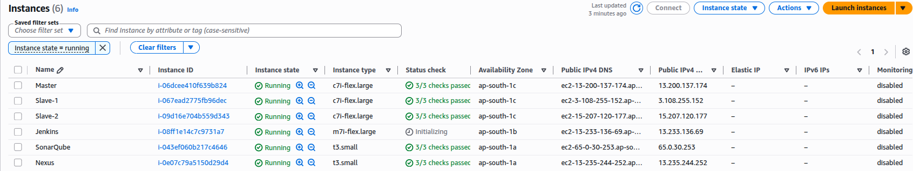

*All server instances running in the EC2 dashboard.*

Connect to each instance and run the first command:

```bash
sudo apt update
```

### 1.7 Install Docker on All Tool Servers

Docker is needed to run SonarQube and Nexus as containers, and also for building Docker images in Jenkins.

Run the following on **SonarQube, Nexus, and Jenkins servers**:

```bash
# Add Docker's official GPG key
sudo apt update
sudo apt install -y ca-certificates curl
sudo install -m 0755 -d /etc/apt/keyrings
sudo curl -fsSL https://download.docker.com/linux/ubuntu/gpg -o /etc/apt/keyrings/docker.asc
sudo chmod a+r /etc/apt/keyrings/docker.asc

# Add the Docker repository
sudo tee /etc/apt/sources.list.d/docker.sources <<EOF
Types: deb
URIs: https://download.docker.com/linux/ubuntu
Suites: $(. /etc/os-release && echo "${UBUNTU_CODENAME:-$VERSION_CODENAME}")
Components: stable
Architectures: $(dpkg --print-architecture)
Signed-By: /etc/apt/keyrings/docker.asc
EOF

sudo apt update
sudo apt install -y docker-ce docker-ce-cli containerd.io docker-buildx-plugin docker-compose-plugin
```

After installation, grant Docker access to non-root users:

```bash
sudo chmod 666 /var/run/docker.sock
```

> **Why this matters:** By default, only the `root` user can run Docker commands. This command allows the `ubuntu` user to execute Docker commands without `sudo`.

### 1.8 Set Up SonarQube

Run this on the **SonarQube server**:

```bash
docker run -d --name sonar -p 9000:9000 sonarqube:lts-community
```

| Flag | What It Does |
|------|-------------|
| `-d` | Runs the container in detached mode (background) |
| `--name sonar` | Names the container "sonar" |
| `-p 9000:9000` | Maps host port 9000 to container port 9000 |

**Verify it is running:**

```bash
docker ps
```

**Expected output:**

```
CONTAINER ID   IMAGE                     COMMAND                  STATUS         PORTS                    NAMES
d3967f37e498   sonarqube:lts-community   "/opt/sonarqube/dock..." Up About a min 0.0.0.0:9000->9000/tcp   sonar
```

**Access SonarQube:** Open `http://<SONAR_PUBLIC_IP>:9000` in your browser.

- **Default credentials:** `admin` / `admin`
- You will be prompted to change the password on first login

### 1.9 Set Up Nexus

Run this on the **Nexus server**:

```bash
docker run -d --name nexus -p 8081:8081 sonatype/nexus3
```

**Access Nexus:** Open `http://<NEXUS_PUBLIC_IP>:8081` in your browser.

**Retrieve the initial admin password:**

Nexus stores the initial password inside the container. To get it:

```bash
# Find the container ID
docker ps

# Execute into the container
docker exec -it <CONTAINER_ID> /bin/sh

# Inside the container, read the password file
cat /nexus-data/admin.password
```

> **Note:** If `/bin/sh` does not work, try `/bin/bash`.

Copy the password, paste it in the browser, and set a new password. You can enable or disable **Anonymous Access** based on your preference.

### 1.10 Set Up Jenkins

Connect to the **Jenkins server** and install Jenkins.

**Step 1: Install Java (JDK 25)**

Jenkins requires Java to run. Install JDK 25 or above:

```bash
sudo apt update
sudo apt install -y openjdk-25-jdk
```

**Step 2: Install Jenkins**

```bash
# Add Jenkins GPG key
curl -fsSL https://pkg.jenkins.io/debian-stable/jenkins.io-2023.key | sudo tee /usr/share/keyrings/jenkins-keyring.asc > /dev/null

# Add Jenkins repository
echo "deb [signed-by=/usr/share/keyrings/jenkins-keyring.asc] https://pkg.jenkins.io/debian-stable binary/" | sudo tee /etc/apt/sources.list.d/jenkins.list > /dev/null

# Install Jenkins
sudo apt update
sudo apt install -y jenkins
```

**Step 3: Install Docker on Jenkins (if not already done)**

Follow the Docker installation steps from [Section 1.7](#17-install-docker-on-all-tool-servers) on the Jenkins server as well.

**Step 4: Access Jenkins**

Open `http://<JENKINS_PUBLIC_IP>:8080` in your browser.

```bash
# Get the initial admin password
sudo cat /var/lib/jenkins/secrets/initialAdminPassword
```

Paste the password in the browser. On the **Customize Jenkins** page, select **Install suggested plugins**. Once plugins are installed, create your admin account.

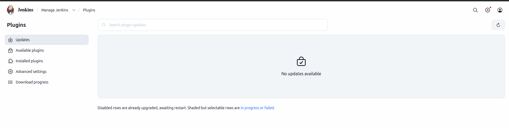

*Jenkins plugin manager.*

---

## Phase 2 — Source Code Management

### Create a Private GitHub Repository

1. Log in to **GitHub** and create a **new private repository**
2. Name it (e.g., `ci-cd-pipeline-test-app`)
3. **Clone** the repository to your local machine:

```bash
git clone https://github.com/<YOUR_USERNAME>/<REPO_NAME>.git
```

4. Copy your Spring Boot project source code into the cloned repository folder
5. Push the code:

```bash
cd <REPO_NAME>
git add .
git commit -m "Initial commit: Add source code"
git push origin main
```

> **Important:** GitHub no longer supports password authentication for Git operations. You must use a **Personal Access Token** (PAT). Generate one at **GitHub > Settings > Developer settings > Personal access tokens > Tokens (classic)**.

---

## Phase 3 — CI/CD Pipeline Configuration

### 3.1 Install Jenkins Plugins

Go to **Manage Jenkins > Plugins > Available Plugins** and install the following:

| Plugin | Purpose |
|--------|---------|
| Eclipse Temurin Installer | Manages JDK installations automatically |
| Pipeline: Stage View | Visualizes each pipeline stage in the UI |
| Config File Provider | Manages settings.xml files for Maven/Nexus integration |
| Pipeline Maven Integration | Integrates Maven tools into Jenkins pipelines |
| SonarQube Scanner | Runs SonarQube analysis from Jenkins |
| Docker | Docker tool integration |
| Docker Pipeline | Docker commands in Jenkins pipelines |
| Kubernetes Client API | Kubernetes API client for Jenkins |
| Kubernetes Credentials | Manages Kubernetes authentication credentials |
| Kubernetes | Kubernetes integration for dynamic build agents |
| Kubernetes CLI | kubectl commands in Jenkins pipelines |
| Maven Integration | Maven project type for Jenkins |
| Prometheus Metrics | Exposes Jenkins metrics for Prometheus monitoring |

After installation, **restart Jenkins** if prompted:

```
http://<JENKINS_IP>:8080/restart
```

### 3.2 Configure Jenkins Tools

Go to **Manage Jenkins > Tools** and configure:

#### JDK

1. Scroll to **JDK installations** and click **Add JDK**
2. Name it `jdk25`
3. Select **Install automatically** and choose a version (25+)

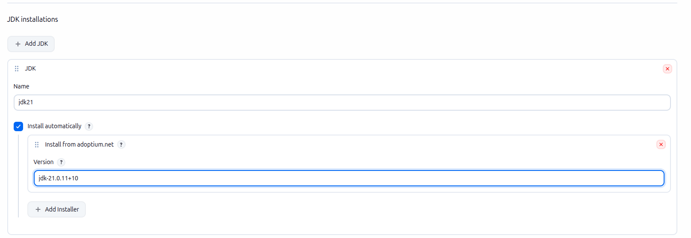

*Configuring JDK installation in Jenkins Tools.*

#### SonarQube Scanner

1. Find **SonarQube Scanner installations** and click **Add**
2. Name it `sonar-scanner`
3. Select **Install automatically**

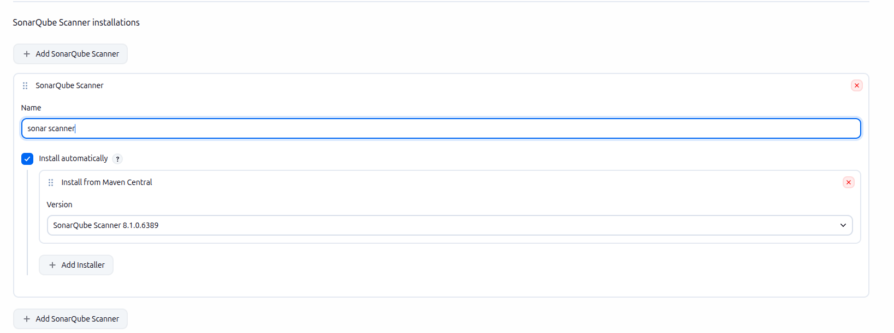

*Configuring SonarQube Scanner in Jenkins Tools.*

#### Maven

1. Find **Maven installations** and click **Add Maven**
2. Name it `maven`
3. Select a version (e.g., 3.6.1 or later)

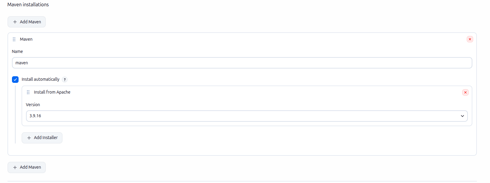

*Configuring Maven installation in Jenkins Tools.*

#### Docker

1. Find **Docker installations** and click **Add Docker**
2. Name it `docker`
3. Select **Install automatically** from docker.com

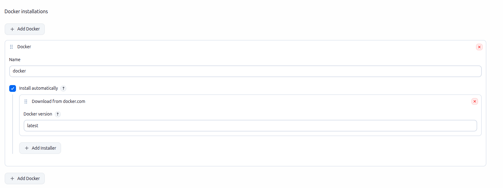

*Configuring Docker installation in Jenkins Tools.*

### 3.3 Create the Jenkins Pipeline

1. Go to **Jenkins Dashboard > New Item**
2. Enter a name (e.g., `ci-cd-pipeline`) and select **Pipeline**
3. Click **OK**

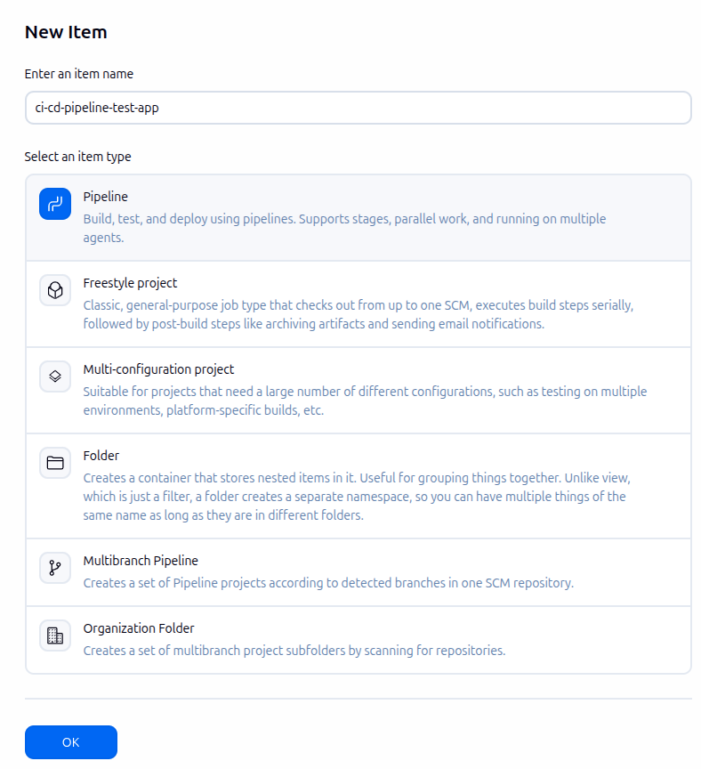

*Creating a new Pipeline item in Jenkins.*

4. In the configuration page:

**General:**
- Check **Discard old builds**
- Set **Max # of builds to keep** to `3`

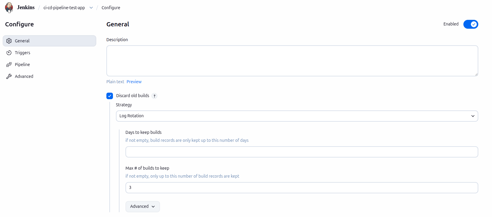

*Configuring build retention to keep only recent builds.*

**Pipeline:**
- Select **Pipeline script** from the dropdown
- Choose **Hello World** template to get started, then customize it

### 3.4 Pipeline Stages Explained

Here is the complete Jenkins pipeline. Each stage is explained below:

#### Full Pipeline Script

```groovy
pipeline {
    agent any

    tools {
        jdk 'jdk25'
        maven 'maven'
    }

    environment {
        SCANNER_HOME = tool 'sonar-scanner'
    }

    stages {
        stage('Git Checkout') {
            steps {
                git branch: 'main', credentialsId: 'git-cred', url: 'https://github.com/<YOUR_USERNAME>/<REPO_NAME>.git'
            }
        }

        stage('Compile') {
            steps {
                sh 'mvn compile'
            }
        }

        stage('Test') {
            steps {
                sh 'mvn test'
            }
        }

        stage('File System Scan') {
            steps {
                sh 'trivy fs --format table -o trivy-fs-report.html .'
            }
        }

        stage('SonarQube Analysis') {
            steps {
                withSonarQubeEnv('sonar') {
                    sh ''' $SCANNER_HOME/bin/sonar-scanner -Dsonar.projectName=<PROJECT_NAME> -Dsonar.projectKey=<PROJECT_NAME> \
                    -Dsonar.java.binaries=. '''
                }
            }
        }

        stage('Quality Gate') {
            steps {
                waitForQualityGate abortPipeline: false, credentialsId: 'sonar-token'
            }
        }

        stage('Build') {
            steps {
                sh 'mvn package'
            }
        }

        stage('Publish to Nexus') {
            steps {
                withMaven(
                    globalMavenSettingsConfig: 'global-settings',
                    jdk: 'jdk25',
                    maven: 'maven'
                ) {
                    sh 'mvn deploy'
                }
            }
        }

        stage('Build & Tag Docker Image') {
            steps {
                sh 'docker build -t <DOCKERHUB_USERNAME>/<IMAGE_NAME>:latest .'
            }
        }

        stage('Docker Image Scan') {
            steps {
                sh 'trivy image --format table -o trivy-image-report.html <DOCKERHUB_USERNAME>/<IMAGE_NAME>:latest'
            }
        }

        stage('Push Docker Image') {
            steps {
                script {
                    withDockerRegistry(
                        credentialsId: 'docker-credentials',
                        url: 'https://index.docker.io/v1/'
                    ) {
                        sh 'docker push <DOCKERHUB_USERNAME>/<IMAGE_NAME>:latest'
                    }
                }
            }
        }

        stage('Deploy to Kubernetes') {
            steps {
                withKubeConfig(
                    caCertificate: '',
                    clusterName: 'kubernetes',
                    contextName: '',
                    credentialsId: 'k8-cred',
                    namespace: 'webapps',
                    restrictKubeConfigAccess: false,
                    serverUrl: 'https://<MASTER_PRIVATE_IP>:6443'
                ) {
                    sh 'kubectl apply -f deployment-service.yaml'
                }
            }
        }

        stage('Verify Deployment') {
            steps {
                withKubeConfig(
                    caCertificate: '',
                    clusterName: 'kubernetes',
                    contextName: '',
                    credentialsId: 'k8-cred',
                    namespace: 'webapps',
                    restrictKubeConfigAccess: false,
                    serverUrl: 'https://<MASTER_PRIVATE_IP>:6443'
                ) {
                    sh 'kubectl get pods -n webapps'
                    sh 'kubectl get svc -n webapps'
                }
            }
        }
    }

    post {
        always {
            emailext (
                subject: "Pipeline: ${currentBuild.fullDisplayName} - ${currentBuild.result}",
                body: "Check console output at ${env.BUILD_URL}",
                to: '<YOUR_EMAIL@gmail.com>',
                from: '<YOUR_EMAIL@gmail.com>',
                attachLog: true,
                attachmentsPattern: 'trivy-image-report.html'
            )
        }
    }
}
```

> **Note:** Replace all `<PLACEHOLDERS>` with your actual values.

#### Stage-by-Stage Explanation

| Stage | Command | What It Does |
|-------|---------|-------------|
| **Git Checkout** | git branch: 'main', credentialsId: 'git-cred', url: '...' | Pulls the source code from your private GitHub repository into Jenkins workspace |
| **Compile** | mvn compile | Compiles the Java source code to check for syntax errors |
| **Test** | mvn test | Runs unit tests to verify functionality |
| **File System Scan** | trivy fs --format table -o trivy-fs-report.html . | Scans the entire project for known vulnerabilities in dependencies |
| **SonarQube Analysis** | sonar-scanner -Dsonar.projectName=... | Analyzes code quality (bugs, code smells, vulnerabilities) and publishes results to SonarQube server |
| **Quality Gate** | waitForQualityGate | Checks if the code passes the quality conditions defined in SonarQube. If it fails, the pipeline can abort |
| **Build** | mvn package | Packages the application into a JAR file |
| **Publish to Nexus** | mvn deploy | Uploads the JAR artifact to Nexus repository for version management |
| **Build Docker Image** | docker build -t user/image:latest . | Creates a Docker image from the Dockerfile in your project |
| **Docker Image Scan** | trivy image --format table -o trivy-image-report.html image | Scans the Docker image for OS and library vulnerabilities |
| **Push Docker Image** | docker push user/image:latest | Uploads the image to Docker Hub so Kubernetes can pull it |
| **Deploy to Kubernetes** | kubectl apply -f deployment-service.yaml | Applies the deployment and service manifests to the Kubernetes cluster |
| **Verify Deployment** | kubectl get pods -n webapps | Confirms that pods are running and the service is created |

> **Tip:** Use the **Pipeline Syntax** tool (available below the pipeline editor) to generate the Git checkout step. Select **git** from the sample step dropdown, enter your repository URL, branch, and credentials, then click **Generate Pipeline Script**.

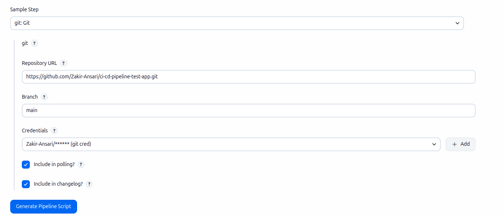

*Using Pipeline Syntax generator to create the Git checkout step.*

#### Setting Up Credentials in Jenkins

Before running the pipeline, add these credentials in **Manage Jenkins > Credentials > Global**:

| Credential ID | Type | Purpose |
|---------------|------|---------|
| `git-cred` | Username with password | GitHub username + Personal Access Token for cloning the repo |
| `sonar-token` | Secret text | SonarQube authentication token (generate at SonarQube > Administration > Security > Users > Tokens) |
| `docker-credentials` | Username with password | Docker Hub username + password for pushing images |
| `k8-cred` | Secret text | Kubernetes service account token for cluster access (created in Phase 4) |

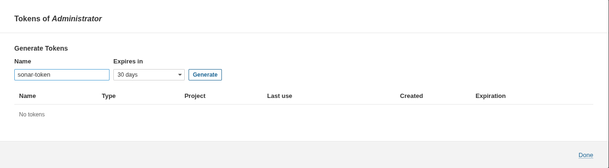

*Generating a token in SonarQube for Jenkins authentication.*

#### Configuring SonarQube Server in Jenkins

1. Go to **Manage Jenkins > System** and scroll to **SonarQube servers**
2. Click **Add SonarQube**
3. Enter:
   - **Name:** `sonar`
   - **Server URL:** `http://<SONARQUBE_IP>:9000`
   - **Authentication Token:** Select the `sonar-token` credential

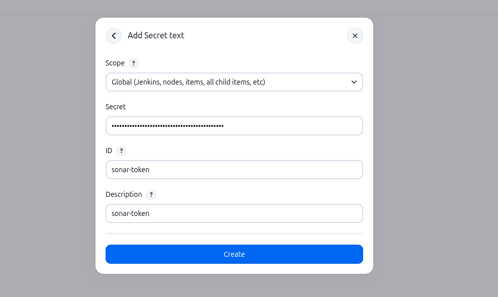

*Adding SonarQube token as a Jenkins credential (Secret text type).*

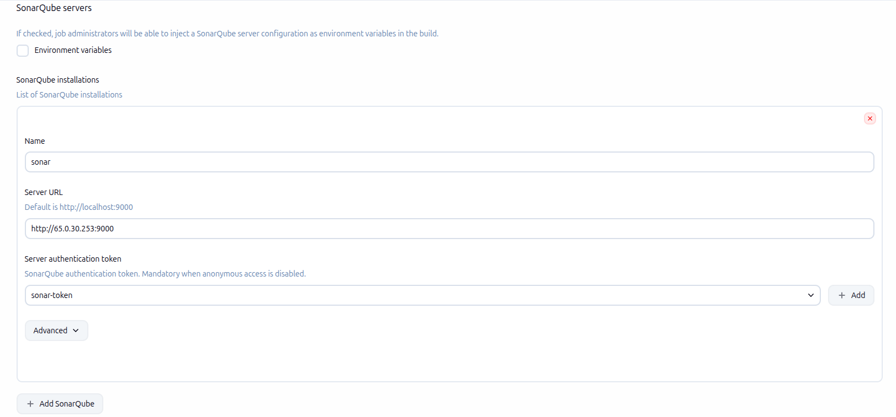

*Configuring the SonarQube server in Jenkins System settings.*

#### Configuring Nexus Credentials in Jenkins

1. Go to **Manage Jenkins > Managed files**
2. Click **Create new configuration** > Select **Global Maven settings.xml**
3. Set the ID to `global-settings`
4. In the content, find the `<servers>` section and add:

```xml
<server>
    <id>maven-releases</id>
    <username>admin</username>
    <password>your-nexus-password</password>
</server>
<server>
    <id>maven-snapshots</id>
    <username>admin</username>
    <password>your-nexus-password</password>
</server>
```

#### Configuring Nexus Repository URLs in Your Project

In your project's `pom.xml`, add the distribution management section:

```xml
<distributionManagement>
    <repository>
        <id>maven-releases</id>
        <url>http://<NEXUS_IP>:8081/repository/maven-releases</url>
    </repository>
    <snapshotRepository>
        <id>maven-snapshots</id>
        <url>http://<NEXUS_IP>:8081/repository/maven-snapshots</url>
    </snapshotRepository>
</distributionManagement>
```

#### Configuring SonarQube Webhook

To enable the Quality Gate check, create a webhook in SonarQube:

1. Go to **SonarQube > Administration > Configuration > Webhooks**
2. Click **Create Webhook**
3. Enter:
   - **Name:** `jenkins`
   - **URL:** `http://<JENKINS_IP>:8080/sonarqube-webhook/`
4. Click **Create**

#### Installing Trivy on Jenkins

Trivy has no Jenkins plugin, so install it directly on the Jenkins server:

```bash
sudo apt-get install -y wget apt-transport-https gnupg lsb-release
wget -qO - https://aquasecurity.github.io/trivy-repo/deb/public.key | gpg --dearmor | sudo tee /usr/share/keyrings/trivy.gpg > /dev/null
echo "deb [signed-by=/usr/share/keyrings/trivy.gpg] https://aquasecurity.github.io/trivy-repo/deb $(lsb_release -sc) main" | sudo tee /etc/apt/sources.list.d/trivy.list
sudo apt-get update
sudo apt-get install -y trivy
```

**Verify installation:**

```bash
trivy --version
```

After running the pipeline successfully, you can view the results:

**Jenkins Job Dashboard:**

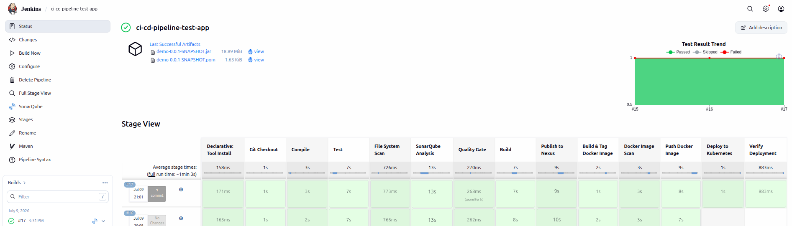

*Jenkins pipeline showing all stages completed successfully.*

**Trivy Security Reports (in Jenkins Workspace):**

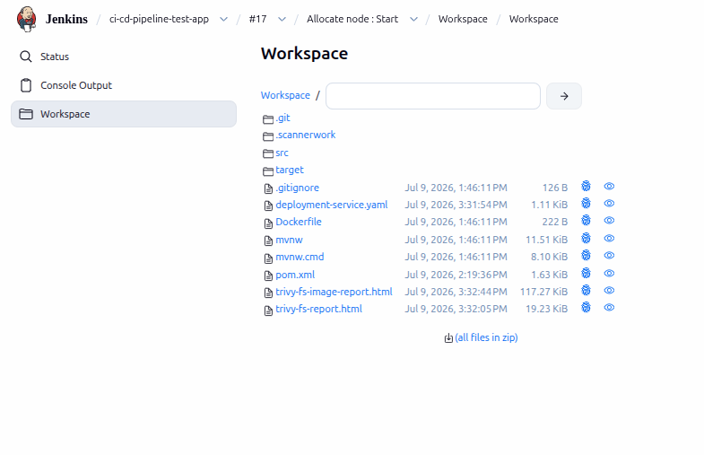

*Trivy vulnerability scan reports available in the Jenkins workspace.*

**SonarQube Project Dashboard:**

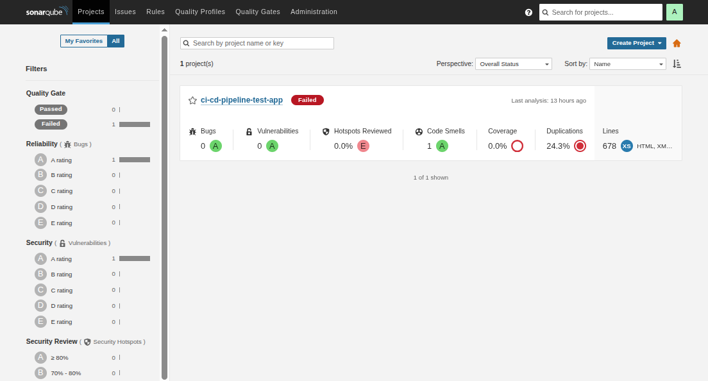

*SonarQube dashboard showing code quality analysis results for the project.*

---

## Phase 4 — Kubernetes Deployment Setup

Before Jenkins can deploy to the Kubernetes cluster, you need to create a **service account** with proper permissions using **RBAC (Role-Based Access Control)**.

> **What is RBAC?** RBAC is a security model where you define roles with specific permissions and assign them to users or service accounts. Instead of giving everyone full access, you grant only the permissions needed for their job.

### 4.1 Create a Service Account (RBAC)

On the **Master node**, create the following YAML files:

**File 1: `svc_acc_create.yml`** — Creates a service account named `jenkins`:

```yaml
apiVersion: v1
kind: ServiceAccount
metadata:
  name: jenkins
  namespace: webapps
```

**Create the namespace first, then apply:**

```bash
kubectl create ns webapps
kubectl apply -f svc_acc_create.yml
```

**File 2: `svc_acc_role.yml`** — Defines a role with full deployment permissions:

```yaml
apiVersion: rbac.authorization.k8s.io/v1
kind: Role
metadata:
  name: app-role
  namespace: webapps
rules:
  - apiGroups:
      - ""
      - apps
      - autoscaling
      - batch
      - extensions
      - policy
      - rbac.authorization.k8s.io
    resources:
      - pods
      - secrets
      - componentstatuses
      - configmaps
      - daemonsets
      - deployments
      - events
      - endpoints
      - horizontalpodautoscalers
      - ingress
      - jobs
      - limitranges
      - namespaces
      - nodes
      - persistentvolumes
      - persistentvolumeclaims
      - resourcequotas
      - replicasets
      - replicationcontrollers
      - serviceaccounts
      - services
    verbs: ["get", "list", "watch", "create", "update", "patch", "delete"]
```

```bash
kubectl apply -f svc_acc_role.yml
```

**File 3: `svc_acc_bind.yml`** — Binds the role to the service account:

```yaml
apiVersion: rbac.authorization.k8s.io/v1
kind: RoleBinding
metadata:
  name: app-rolebinding
  namespace: webapps
roleRef:
  apiGroup: rbac.authorization.k8s.io
  kind: Role
  name: app-role
subjects:
  - namespace: webapps
    kind: ServiceAccount
    name: jenkins
```

```bash
kubectl apply -f svc_acc_bind.yml
```

### 4.2 Generate a Token for Jenkins

Create a secret to generate an authentication token:

**File 4: `svc_acc_secret.yml`**:

```yaml
apiVersion: v1
kind: Secret
type: kubernetes.io/service-account-token
metadata:
  name: mysecretname
  annotations:
    kubernetes.io/service-account.name: jenkins
```

```bash
kubectl apply -f svc_acc_secret.yml -n webapps
```

**Retrieve the token:**

```bash
kubectl describe secret mysecretname -n webapps
```

Copy the `token` value from the output. Then go to **Jenkins > Manage Jenkins > Credentials > Global > Add Credentials**:

- **Kind:** Secret text
- **Secret:** Paste the token
- **ID:** `k8-cred`
- **Description:** Kubernetes cluster token

### 4.3 Install kubectl on Jenkins

Jenkins needs `kubectl` to interact with the Kubernetes cluster. Install it on the Jenkins server:

```bash
curl -LO "https://dl.k8s.io/release/$(curl -L -s https://dl.k8s.io/release/stable.txt)/bin/linux/amd64/kubectl"
chmod +x kubectl
sudo mv kubectl /usr/local/bin/
kubectl version --client
```

### 4.4 Create Deployment & Service Manifests

Add a `deployment-service.yaml` file to the **root of your GitHub repository**:

```yaml
apiVersion: apps/v1
kind: Deployment
metadata:
  name: ci-cd-pipeline-test-app-deployment
spec:
  selector:
    matchLabels:
      app: ci-cd-pipeline-test-app
  replicas: 2
  template:
    metadata:
      labels:
        app: ci-cd-pipeline-test-app
    spec:
      containers:
        - name: ci-cd-pipeline-test-app
          image: <DOCKERHUB_USERNAME>/<IMAGE_NAME>:latest
          imagePullPolicy: IfNotPresent
          ports:
            - containerPort: 8080

---

apiVersion: v1
kind: Service
metadata:
  name: ci-cd-pipeline-test-app-svc
spec:
  selector:
    app: ci-cd-pipeline-test-app
  ports:
    - protocol: "TCP"
      port: 8080
      targetPort: 8080
  type: LoadBalancer
```

> **Note:** On a self-hosted Kubernetes cluster (like ours), LoadBalancer services may not automatically get an external IP. In that case, access the app using the NodePort: `http://<ANY_NODE_IP>:<NODE_PORT>`.

### 4.5 Deploy & Verify

Run the Jenkins pipeline. After successful execution, check the deployment:

```bash
# On the Master node
kubectl get pods -n webapps
kubectl get svc -n webapps
```

**Expected output:**

```
NAME                                                  READY   STATUS    RESTARTS   AGE
ci-cd-pipeline-test-app-deployment-5c4669586c-4pt9r   1/1     Running   0          30s
ci-cd-pipeline-test-app-deployment-5c4669586c-75t5n   1/1     Running   0          30s

NAME                           TYPE           CLUSTER-IP      EXTERNAL-IP   PORT(S)          AGE
ci-cd-pipeline-test-app-svc    LoadBalancer   10.107.153.15   <pending>     8080:31265/TCP   30s
```

**Access your application** at `http://<ANY_NODE_IP>:31265` (use the NodePort shown in the output).

---

## Phase 5 — Monitoring

### Monitoring Architecture Overview

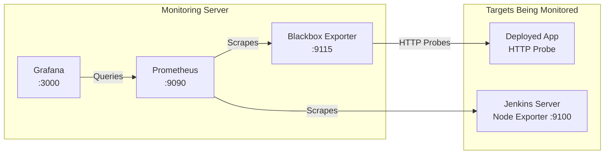
```mermaid
flowchart LR
    subgraph MONITOR["Monitoring Server"]
        PROM[Prometheus<br/>:9090]
        GRAF[Grafana<br/>:3000]
        BB[Blackbox Exporter<br/>:9115]
    end

    subgraph TARGETS["Targets Being Monitored"]
        APP[Deployed App<br/>HTTP Probe]
        JENK[Jenkins Server<br/>Node Exporter :9100]
    end

    BB -->|HTTP Probes| APP
    PROM -->|Scrapes| BB
    PROM -->|Scrapes| JENK
    GRAF -->|Queries| PROM
```

### 5.1 Set Up Prometheus

Create a new EC2 instance named **Monitor** (t2.large recommended) and connect to it.

```bash
sudo apt update

# Download Prometheus
wget https://github.com/prometheus/prometheus/releases/download/v3.13.0/prometheus-3.13.0.linux-amd64.tar.gz

# Extract
tar -xvf prometheus-3.13.0.linux-amd64.tar.gz

# Enter the directory
cd prometheus-3.13.0.linux-amd64

# Run Prometheus in background
./prometheus &
```

By default, Prometheus runs on port **9090**. Access it at `http://<MONITOR_IP>:9090`.

**To run on a custom port:**

```bash
nohup ./prometheus --config.file=prometheus.yml --web.listen-address=:8080 > prometheus.log 2>&1 &
```

| Part | What It Does |
|------|-------------|
| `nohup` | Keeps the process running even after you log out |
| `--config.file=prometheus.yml` | Specifies the configuration file |
| `--web.listen-address=:8080` | Runs Prometheus on port 8080 instead of the default 9090 |
| `> prometheus.log 2>&1` | Redirects output to a log file |
| `&` | Runs the process in the background |

### 5.2 Set Up Grafana

On the **Monitor server**, install Grafana:

```bash
# Add Grafana GPG key
sudo mkdir -p /etc/apt/keyrings/
wget -q -O - https://apt.grafana.com/gpg.key | gpg --dearmor | sudo tee /etc/apt/keyrings/grafana.gpg > /dev/null

# Add Grafana repository
echo "deb [signed-by=/etc/apt/keyrings/grafana.gpg] https://apt.grafana.com stable main" | sudo tee /etc/apt/sources.list.d/grafana.list

# Install Grafana
sudo apt-get update
sudo apt-get install -y grafana

# Start Grafana
sudo /bin/systemctl start grafana-server
```

**Access Grafana:** Open `http://<MONITOR_IP>:3000`

- **Default credentials:** `admin` / `admin`
- You will be prompted to change the password on first login

### 5.3 Set Up Blackbox Exporter

The **Blackbox Exporter** probes your websites from the outside to check uptime and response time.

On the **Monitor server**:

```bash
# Download Blackbox Exporter
wget https://github.com/prometheus/blackbox_exporter/releases/download/v0.28.0/blackbox_exporter-0.28.0.linux-amd64.tar.gz

# Extract
tar -xvf blackbox_exporter-0.28.0.linux-amd64.tar.gz

# Enter directory and run
cd blackbox_exporter-0.28.0.linux-amd64
./blackbox_exporter &
```

Blackbox Exporter runs on port **9115** by default. Access it at `http://<MONITOR_IP>:9115`.

### 5.4 Configure Prometheus to Scrape Targets

Edit the `prometheus.yml` file in the Prometheus folder and add scrape jobs:

```yaml
global:
  scrape_interval: 15s
  evaluation_interval: 15s

scrape_configs:
  - job_name: "prometheus"
    static_configs:
      - targets: ["localhost:9090"]
        labels:
          app: "prometheus"

  - job_name: "blackbox"
    metrics_path: /probe
    params:
      module: [http_2xx]
    static_configs:
      - targets:
          - http://prometheus.io
          - http://<YOUR_APP_URL>:<NODE_PORT>
    relabel_configs:
      - source_labels: [__address__]
        target_label: __param_target
      - source_labels: [__param_target]
        target_label: instance
      - target_label: __address__
        replacement: <MONITOR_IP>:9115

  - job_name: "jenkins"
    static_configs:
      - targets: ["<JENKINS_IP>:8080"]
        labels:
          app: "jenkins"
```

**Restart Prometheus** after editing:

```bash
# Find and kill the running Prometheus process
pgrep prometheus
kill <PID>

# Restart
cd /path/to/prometheus
./prometheus &
```

After restarting, verify that your targets are being scraped by visiting `http://<MONITOR_IP>:9090/targets`.

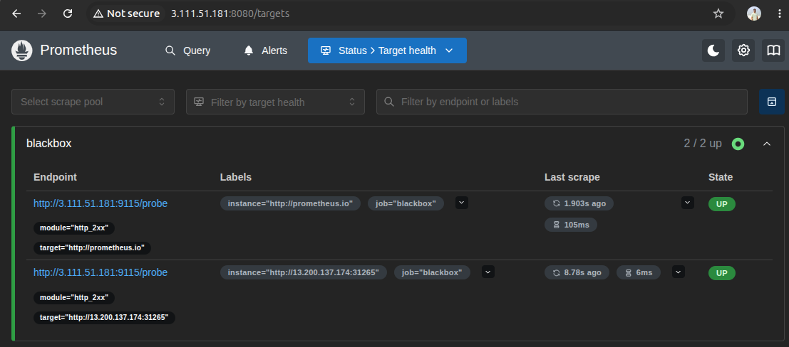

*Prometheus Targets page showing Blackbox and Jenkins exporters as UP.*

### 5.5 Connect Prometheus to Grafana

1. Open Grafana at `http://<MONITOR_IP>:3000`
2. Go to **Connections (left nav) > Data sources > Add data source**
3. Select **Prometheus**
4. Enter the Prometheus URL: `http://<MONITOR_IP>:9090`
5. Click **Save & Test**

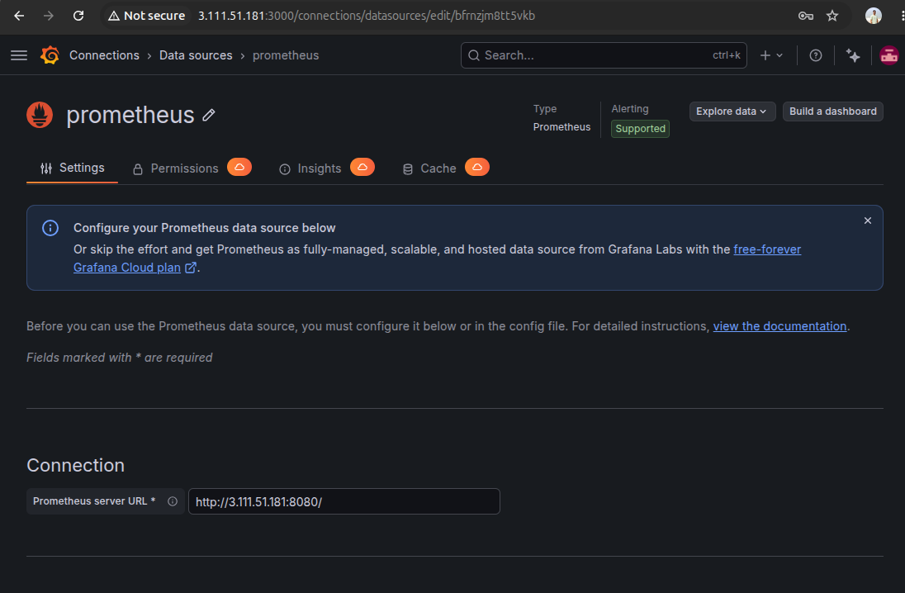

*Adding Prometheus as a data source in Grafana.*

### 5.6 Import a Grafana Dashboard

1. In Grafana, click the **+** icon (top) > **Import dashboard**
2. Search for a dashboard on [grafana.com/grafana/dashboards](https://grafana.com/grafana/dashboards)
3. For Blackbox monitoring, use dashboard ID **7587** (Prometheus Blackbox Exporter)
4. Paste the ID, click **Load**, select your **Prometheus** data source, and click **Import**

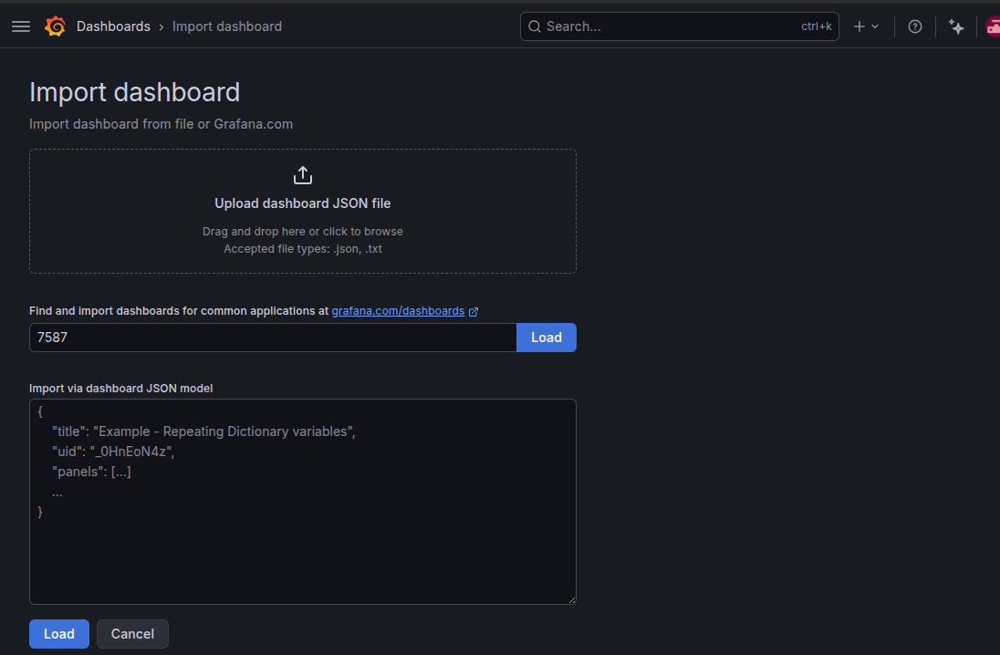

*Entering the dashboard ID in Grafana Import.*

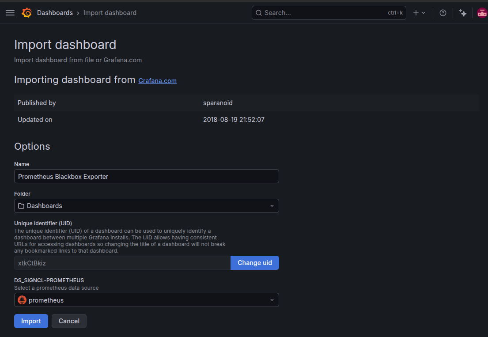

*Selecting Prometheus as the data source during dashboard import.*

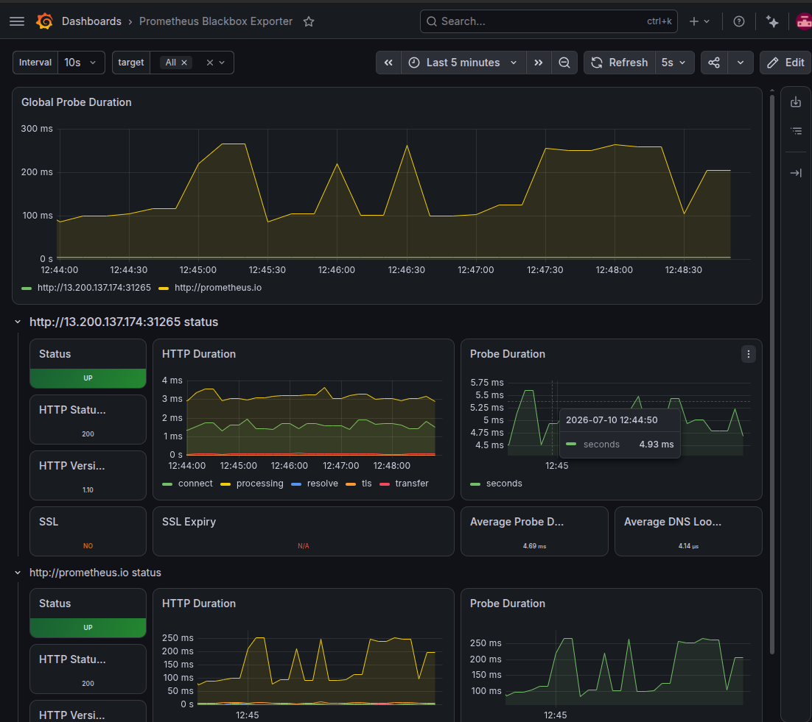

*Grafana dashboard showing Blackbox Exporter probe results for the deployed application.*

### 5.7 System-Level Monitoring with Node Exporter

**Node Exporter** reports CPU, RAM, disk, and network metrics from a server. We will monitor Jenkins system metrics.

**Step 1: Install the Prometheus Metrics plugin in Jenkins**

Go to **Manage Jenkins > Plugins** and install **Prometheus metrics**. Restart Jenkins if prompted.

**Step 2: Install Node Exporter on the Jenkins server**

```bash
# Download Node Exporter
wget https://github.com/prometheus/node_exporter/releases/download/v1.8.1/node_exporter-1.8.1.linux-amd64.tar.gz

# Extract
tar -xvf node_exporter-1.8.1.linux-amd64.tar.gz

# Enter directory and run
cd node_exporter-1.8.1.linux-amd64
./node_exporter &
```

Node Exporter runs on port **9100**. Verify at `http://<JENKINS_IP>:9100/metrics`.

**Step 3: Add the Jenkins job to Prometheus**

Add this scrape config to `prometheus.yml` on the Monitor server:

```yaml
  - job_name: "jenkins-node"
    static_configs:
      - targets: ["<JENKINS_IP>:9100"]
```

Restart Prometheus and import a **Node Exporter dashboard** in Grafana (search for dashboard ID **1860** or similar).


*Grafana dashboard showing system metrics (CPU, RAM, network) from the Jenkins server.*

---

## Troubleshooting

| Problem | Possible Cause | Solution |
|---------|---------------|----------|
| `kubectl get nodes` shows `NotReady` | Flannel CNI not installed or not running | Run `kubectl get pods -n kube-flannel` and check pod status |
| Worker cannot join cluster | Security Group blocking port 6443 | Add inbound rule for TCP 6443 from the security group |
| Pods stuck in `ContainerCreating` | Image not found or containerd misconfigured | Check `kubectl describe pod <pod-name>` for events |
| Jenkins cannot deploy to K8s | kubectl not installed or wrong credentials | Install kubectl and verify the `k8-cred` credential |
| SonarQube not accessible | Container not running or port not open | Check `docker ps`, verify security group allows port 9000 |
| Nexus password not working | Wrong password retrieved | Use `docker exec -it <container_id> /bin/sh` then `cat /nexus-data/admin.password` |
| Pipeline fails at Docker build | Docker not installed on Jenkins server | Install Docker on the Jenkins server following Section 1.7 |
| Cannot access application on NodePort | Security Group missing port range | Add inbound rule for TCP 30000-32767 |
| Prometheus not scraping targets | Wrong targets in prometheus.yml | Verify IP addresses and port numbers in the configuration |
| Grafana shows no data | Prometheus data source misconfigured | Check the Prometheus URL in Grafana data source settings |
| Email notifications not working | SMTP port not open or wrong credentials | Ensure port 465 is open; use Gmail App Password, not account password |

---

## Next Steps

Congratulations! You have built a complete CI/CD pipeline from scratch. Here are some ideas to extend what you have learned:

1. **Add Slack or Microsoft Teams notifications** to get real-time alerts on pipeline status
2. **Set up ArgoCD** for GitOps-based Kubernetes deployments instead of using kubectl directly
3. **Implement Helm charts** for more manageable Kubernetes deployments
4. **Add more pipeline stages** like integration testing, performance testing, or staging deployments
5. **Set up Alertmanager** with Prometheus to send alerts when metrics exceed thresholds
6. **Implement infrastructure as code** using Terraform or AWS CloudFormation
7. **Add more exporters** to Prometheus for monitoring databases, message queues, or custom applications

---

<p align="center">
  <strong>End of Tutorial</strong>
</p>
