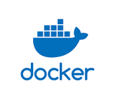
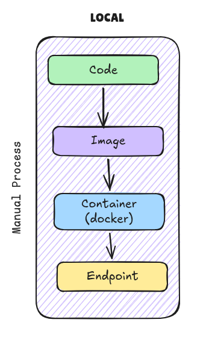
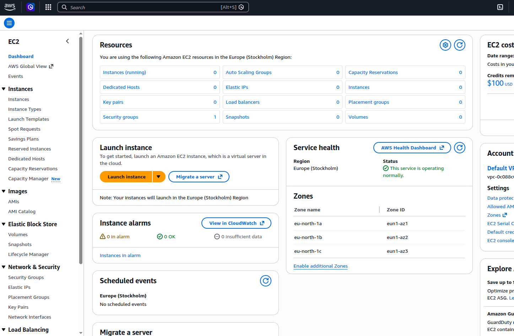
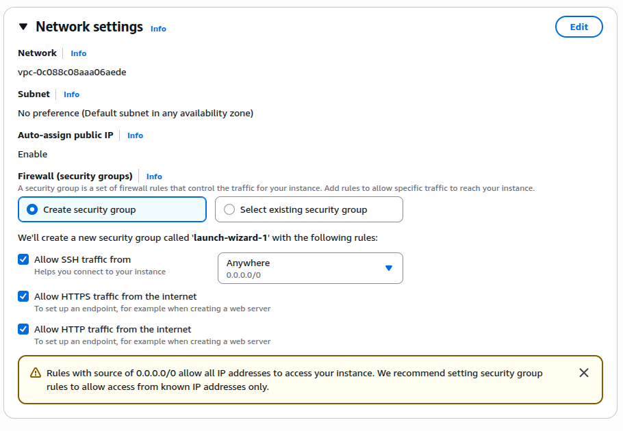
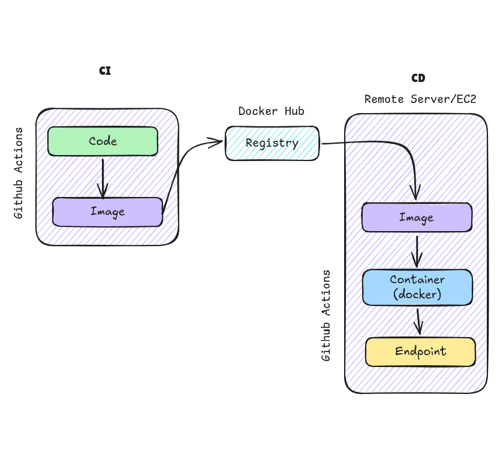

# CI/CD with GitHub Actions & Docker

---

## 📋 Table of Contents

- [Overview](#overview)
- [What is CI/CD?](#what-is-cicd)
- [Technology Stack](#technology-stack)
  - [Docker](#-docker)
  - [GitHub Actions](#-github-actions)
  - [AWS EC2](#-aws-ec2)
  - [Spring Boot](#-spring-boot)
- [Part 1: Manual Deployment to AWS EC2](#part-1-manual-deployment-to-aws-ec2)
  - [Step 1: Build Your Application](#step-1-build-your-application)
  - [Step 2: Containerize with Docker](#step-2-containerize-with-docker)
  - [Step 3: Push to Docker Hub](#step-3-push-to-docker-hub)
  - [Step 4: Setup AWS EC2 Instance](#step-4-setup-aws-ec2-instance)
  - [Step 5: Deploy on EC2](#step-5-deploy-on-ec2)
- [Part 2: Automate with GitHub Actions](#part-2-automate-with-github-actions)
  - [Understanding GitHub Actions](#understanding-github-actions)
  - [Setting Up the Workflow](#setting-up-the-workflow)
  - [Configuring Secrets](#configuring-secrets)
  - [Running the Automated Pipeline](#running-the-automated-pipeline)
- [Troubleshooting](#troubleshooting)
- [Useful Resources](#useful-resources)

---

## Overview

This tutorial guides you through implementing a complete **CI/CD pipeline** using GitHub Actions to automatically build, containerize, and deploy a Spring Boot application to AWS EC2. You'll learn both the manual process and the automated approach.

**What we'll build:**

```
Code Push → Build JAR → Create Docker Image → Push to Registry → Deploy to EC2 → Live Application
```

---

## What is CI/CD?

**CI/CD** stands for **Continuous Integration / Continuous Deployment**, a software development practice that automates the process of building, testing, and deploying applications.

| Term                            | Description                                                                     |
| ------------------------------- | ------------------------------------------------------------------------------- |
| **CI (Continuous Integration)** | Automatically build and test code whenever changes are pushed to the repository |
| **CD (Continuous Deployment)**  | Automatically deploy tested code to production environments                     |
| **Benefits**                    | Faster releases, fewer errors, consistent deployments, reduced manual work      |

---

## Technology Stack

### 🐳 Docker



**What is Docker?**

Docker is a containerization platform that packages your application with all its dependencies into a lightweight, portable container. This ensures your app runs the same way everywhere.

| Concept        | Explanation                                                                              |
| -------------- | ---------------------------------------------------------------------------------------- |
| **Container**  | A lightweight, standalone executable package containing everything needed to run the app |
| **Image**      | A blueprint/template used to create containers                                           |
| **Docker Hub** | A public registry where you can push and pull Docker images                              |
| **Benefits**   | Consistency across environments, easy deployment, easy scaling                           |

**Docker Workflow:**

```
Application Code + Dependencies → Docker Image → Docker Container → Running Application
```

---

### 🚀 GitHub Actions


**What is GitHub Actions?**

GitHub Actions is a CI/CD service built into GitHub that lets you automate workflows. When you push code, it can automatically build, test, and deploy your application.

| Feature       | Explanation                                                       |
| ------------- | ----------------------------------------------------------------- |
| **Workflows** | Automated processes defined in YAML files in `.github/workflows/` |
| **Triggers**  | Events that start a workflow (e.g., push, pull request)           |
| **Jobs**      | Tasks that run as part of a workflow                              |
| **Actions**   | Reusable units of code (provided by GitHub or community)          |
| **Secrets**   | Secure storage for sensitive data (API keys, passwords)           |

**Advantages:**

- Free for public repositories
- No separate CI/CD server needed
- Integrated with GitHub
- Access to community-maintained actions

---

### ☁️ AWS EC2


**What is AWS EC2?**

Amazon EC2 (Elastic Compute Cloud) is a cloud computing service that provides resizable virtual servers. You can run your Docker containers on EC2 instances.

| Concept                        | Explanation                                               |
| ------------------------------ | --------------------------------------------------------- |
| **EC2 Instance**               | A virtual server in the cloud                             |
| **AMI (Amazon Machine Image)** | A pre-configured template for launching instances         |
| **Key Pair**                   | SSH credentials used to securely connect to your instance |
| **Security Group**             | Firewall rules that control network access                |
| **Public IP**                  | Address to access your application from the internet      |

**Why use EC2?**

- Built by AWS (reliable and scalable)
- Free tier eligible (t2.micro)
- Full control over your environment
- Easy integration with other AWS services

---

### 🍃 Spring Boot

**What is Spring Boot?**

Spring Boot is a Java framework that simplifies creating production-ready applications. It provides built-in server, dependency management, and auto-configuration.

---

---

# Part 1: Manual Deployment to AWS EC2

In this section, we'll manually walk through each step of deploying a Spring Boot application to AWS EC2 using Docker.



</div>

---

## Step 1: Build Your Application

First, we need to create a JAR (Java Archive) file from our Spring Boot application using Maven.

### Command to Build the Package:

```bash
./mvnw clean package -DskipTests
```

### Command Explanation:

| Command       | Purpose                                                                 |
| ------------- | ----------------------------------------------------------------------- |
| `./mvnw`      | Maven wrapper script (runs Maven without needing it installed globally) |
| `clean`       | Removes any previously built artifacts from the `target/` folder        |
| `package`     | Compiles code and creates a JAR file                                    |
| `-DskipTests` | Skips running unit tests to speed up the build                          |

**Expected Output:**
After running this command, you'll see a JAR file in the `target/` folder (e.g., `demo-0.0.1-SNAPSHOT.jar`)

---

## Step 2: Containerize with Docker

Now we'll create a Docker image of our application. First, create a `Dockerfile` in your project root:

### Dockerfile Content:

```dockerfile
FROM eclipse-temurin:25
WORKDIR /app
# Copy the built JAR file into the container
COPY target/*.jar app.jar
# Expose the application port
EXPOSE 8080
# Run the application
ENTRYPOINT ["java", "-jar", "app.jar"]
```

### Dockerfile Explanation:

| Line                        | Purpose                                    |
| --------------------------- | ------------------------------------------ |
| `FROM eclipse-temurin:25`   | Use Java 25 as the base image              |
| `WORKDIR /app`              | Set working directory inside container     |
| `COPY target/*.jar app.jar` | Copy the built JAR into the container      |
| `EXPOSE 8080`               | Document that the app listens on port 8080 |
| `ENTRYPOINT [...]`          | Command to run when container starts       |

### Build the Docker Image:

```bash
docker build -t my-spring-app:latest .
```

### Run Container Locally:

```bash
docker run -d -p 8080:8080 my-spring-app:latest
```

| Flag           | Meaning                                      |
| -------------- | -------------------------------------------- |
| `-d`           | Run in detached mode (background)            |
| `-p 8080:8080` | Map port 8080 from container to your machine |
| .              | Run the command from current directory       |

**Expected Output:**

```bash
$ docker run -d -p 8080:8080 my-spring-app:latest
abc123def456...  # Container ID
```

You can now access your application at: **`http://localhost:8080/`**

Check running containers:

```bash
docker ps
```

**Expected Output:**

```
CONTAINER ID   IMAGE              COMMAND               STATUS        PORTS
abc123def456   my-spring-app      "java -jar app.jar"   Up 2 seconds  0.0.0.0:8080->8080/tcp
```

---

## Step 3: Push to Docker Hub

To deploy to EC2, we need to push our Docker image to a registry (Docker Hub).

### Create a Docker Hub Account:

1. Go to [Docker Hub](https://hub.docker.com)
2. Sign up for a free account
3. Create a personal access token (Settings → Security)

### Push Your Image:

```bash
# Login to Docker Hub
docker login

# Tag your image with your Docker Hub username
docker tag my-spring-app:latest YOUR_DOCKERHUB_USERNAME/my-spring-app:latest

# Push to Docker Hub
docker push YOUR_DOCKERHUB_USERNAME/my-spring-app:latest
```

**Login Explanation:**

| Command                                      | Purpose                         |
| -------------------------------------------- | ------------------------------- |
| `docker login`                               | Authenticates with Docker Hub   |
| `docker tag <image> <registry>/<name>:<tag>` | Retags image with registry path |
| `docker push <image>`                        | Uploads image to registry       |

**Expected Output:**

```
The push refers to repository [docker.io/your-username/my-spring-app]
abc123: Pushed
def456: Pushed
...
latest: digest: sha256:abc123... size: 856
```

---

## Step 4: Setup AWS EC2 Instance

### Create an EC2 Instance:

1. Login to [AWS Console](https://aws.amazon.com)
2. Go to **EC2 Dashboard** → **Launch Instance**

<div align="center">



</div>

### Configure Your Instance:

| Setting           | Value                             | Reason                          |
| ----------------- | --------------------------------- | ------------------------------- |
| **Name**          | `my-spring-server`                | Identify your instance          |
| **AMI**           | Amazon Linux 2                    | Lightweight, free tier eligible |
| **Instance Type** | t2.micro                          | Free tier eligible              |
| **Key Pair**      | Create new (e.g., `demo-keypair`) | SSH access to instance          |

### Generate SSH Key Pair:

1. Click **Create new key pair**
2. Name it `demo-keypair`
3. Click **Download key pair**
4. Save the `.pem` file in a secure location on your computer

> **💡 Tip:** This key is your only way to access the instance. Keep it safe!

### Network Settings:

<div align="center">



</div>

Create a security group with these inbound rules:

| Type       | Protocol | Port | Source    | Purpose                  |
| ---------- | -------- | ---- | --------- | ------------------------ |
| SSH        | TCP      | 22   | 0.0.0.0/0 | SSH access from anywhere |
| HTTP       | TCP      | 80   | 0.0.0.0/0 | Web traffic              |
| Custom TCP | TCP      | 8080 | 0.0.0.0/0 | Spring Boot app          |

> **⚠️ Note:** Opening to `0.0.0.0/0` (anywhere) is for learning. In production, restrict to your IP.

### Launch the Instance:

Click **Launch Instance** and wait for it to reach **Running** state. Note down the **Public IPv4 address**.

---

## Step 5: Deploy on EC2

### Connect to Your Instance via SSH:

```bash
chmod 400 /path/to/demo-keypair.pem
ssh -i /path/to/demo-keypair.pem ec2-user@<YOUR_PUBLIC_IP>
```

**Expected Output:**

```
   ,     #_
   ~\_  ####_        Amazon Linux 2023
  ~~  \_#####\
  ~~     \###|
  ~~       \#/ ___   https://aws.amazon.com/linux/amazon-linux-2023
   ~~       V~' '->
    ~~~         /
      ~~._.   _/
         _/ _/
       _/m/'
[ec2-user@ip-172-31-xx-xx ~]$
```

### Install Docker on EC2:

```bash
# Update system packages
sudo yum update -y

# Install Docker
sudo yum install docker -y

# Start Docker service
sudo systemctl start docker

# Enable Docker to start on boot
sudo systemctl enable docker

# Add current user to docker group (avoid using sudo)
sudo usermod -aG docker $USER
```

> **💡 Tip:** After adding to docker group, log out and log back in for changes to take effect.

**Verify Docker Installation:**

```bash
docker --version
```

**Expected Output:**

```
Docker version 25.0.14, build 0bab007
```

### Pull and Run Your Docker Container:

```bash
# Pull your image from Docker Hub
docker pull YOUR_DOCKERHUB_USERNAME/my-spring-app:latest

# Run the container
docker run -d --name my-spring-app -p 8080:8080 \
  YOUR_DOCKERHUB_USERNAME/my-spring-app:latest
```

**Check Running Containers:**

```bash
docker ps
```

**Expected Output:**

```
CONTAINER ID   IMAGE                              STATUS        PORTS
abc123def456   your-username/my-spring-app        Up 2 minutes  0.0.0.0:8080->8080/tcp
```

### Access Your Application:

Open your browser and navigate to:

```
http://<YOUR_PUBLIC_IP>:8080/
```

> **✅ Success!** Your Spring Boot application is now running on AWS EC2!

---

---

# Part 2: Automate with GitHub Actions

Now let's automate the entire process above so it happens automatically when you push code.



</div>

---

## Understanding GitHub Actions

GitHub Actions lets you create workflows that automatically run when certain events occur (like pushing code).

### Workflow Execution Flow:

```
Developer pushes code
        ↓
Event triggers (e.g., push to specific branch)
        ↓
GitHub Actions starts the workflow
        ↓
Runs each step in sequence
        ↓
Success/Failure notification
```

### Key Concepts:

| Term              | Meaning                                                       |
| ----------------- | ------------------------------------------------------------- |
| **Workflow File** | YAML file in `.github/workflows/` that defines automation     |
| **Event**         | Trigger for the workflow (push, pull request, schedule, etc.) |
| **Job**           | A set of steps that run on the same runner                    |
| **Step**          | Individual task within a job                                  |
| **Action**        | Reusable code from GitHub Marketplace                         |
| **Runner**        | Server that executes the workflow                             |

---

## Setting Up the Workflow

### Create the Workflow File:

Create a file at `.github/workflows/docker-deploy.yml`:

```yaml
name: Docker Image CI/CD

on:
  push:
    branches: [ "main" ]  # Trigger on push to main branch

jobs:
  build-and-deploy:
    runs-on: ubuntu-latest  # Use Ubuntu runner

    steps:
    # Step 1: Checkout the code
    - name: Checkout Code
      uses: actions/checkout@v4

    # Step 2: Setup Java environment
    - name: Setup Java JDK
      uses: actions/setup-java@v5.2.0
      with:
        distribution: 'temurin'
        java-version: 25

    # Step 3: Build the JAR file
    - name: Build JAR
      run: |
        cd github-actions-ci-cd
        ./mvnw clean package -DskipTests

    # Step 4: Login to Docker Hub
    - name: Login to Docker Hub
      uses: docker/login-action@v4
      with:
        username: ${{ secrets.DOCKERHUB_USERNAME }}
        password: ${{ secrets.DOCKERHUB_TOKEN }}

    # Step 5: Build Docker Image
    - name: Build Docker Image
      run: |
        cd github-actions-ci-cd
        docker build -t ${{ secrets.DOCKERHUB_USERNAME }}/my-spring-app:latest .

    # Step 6: Push Image to Docker Hub
    - name: Push Image to Docker Hub
      run: |
        cd github-actions-ci-cd
        docker push ${{ secrets.DOCKERHUB_USERNAME }}/my-spring-app:latest

    # Step 7: Deploy to EC2
    - name: Deploy to EC2
      uses: appleboy/ssh-action@v1
      with:
        host: ${{ secrets.EC2_HOST }}
        username: ${{ secrets.EC2_USER }}
        key: ${{ secrets.EC2_SSH_KEY }}
        script: |
          docker stop my-spring-app || true
          docker rm my-spring-app || true
          docker pull ${{ secrets.DOCKERHUB_USERNAME }}/my-spring-app:latest
          docker run -d --name my-spring-app -p 8080:8080 \
            ${{ secrets.DOCKERHUB_USERNAME }}/my-spring-app:latest
```

### Workflow Explanation:

| Step                    | Purpose                            |
| ----------------------- | ---------------------------------- |
| **Checkout Code**       | Downloads your repository code     |
| **Setup Java**          | Installs Java 25 runtime           |
| **Build JAR**           | Compiles code and creates JAR file |
| **Login to Docker Hub** | Authenticates with Docker registry |
| **Build Docker Image**  | Creates Docker image from JAR      |
| **Push Image**          | Uploads image to Docker Hub        |
| **Deploy to EC2**       | SSHs into EC2 and runs container   |

---

## Configuring Secrets

Your workflow needs secrets to authenticate with Docker Hub and AWS EC2.

### Add Repository Secrets:

1. Go to your GitHub repository
2. **Settings** → **Secrets and Variables** → **Actions**
3. Click **New repository secret**

### Required Secrets:

| Secret Name          | Value                                  | How to Get                                        |
| -------------------- | -------------------------------------- | ------------------------------------------------- |
| `DOCKERHUB_USERNAME` | Your Docker Hub username               | Docker Hub account settings                       |
| `DOCKERHUB_TOKEN`    | Docker Hub personal access token       | Docker Hub Settings → Security → New Access Token |
| `EC2_HOST`           | Public IP of your EC2 instance         | AWS EC2 Dashboard                                 |
| `EC2_USER`           | EC2 instance user (usually `ec2-user`) | AWS documentation                                 |
| `EC2_SSH_KEY`        | Contents of your `.pem` file           | Download from AWS EC2 key pair                    |

### How to Get Docker Hub Token:

1. Go to [Docker Hub](https://hub.docker.com)
2. Login → **Account Settings**
3. **Security** → **New Access Token**
4. Give it a name (e.g., `github-actions`)
5. Copy the token

### How to Get EC2_SSH_KEY:

1. Open the `.pem` file you downloaded
2. Copy the **entire contents** (including `-----BEGIN...` and `-----END...`)
3. Paste as the secret value

---

## Running the Automated Pipeline

### Important: Stop Previous Manual Deployment

Before pushing code, stop the manually deployed container to free up port 8080:

```bash
# SSH into your EC2 instance
ssh -i /path/to/demo-keypair.pem ec2-user@<YOUR_PUBLIC_IP>

# List running containers
docker ps

# Stop and remove the container
docker stop my-spring-app || true
docker rm my-spring-app || true

# Verify it stopped
docker ps
```

### Trigger the Workflow:

1. Make a change to your code
2. Commit and push to the `main` branch:

```bash
git add .
git commit -m "Update Spring Boot app"
git push origin main
```

### Monitor the Workflow:

1. Go to your GitHub repository
2. Click **Actions** tab
3. You'll see your workflow running in real-time
4. Click on the workflow to see detailed logs

**Workflow Status:**

- 🟡 **In Progress** - Workflow is running
- ✅ **Success** - All steps completed successfully
- ❌ **Failure** - One or more steps failed (check logs)

### Access Your Deployed Application:

Once the workflow completes successfully:

```
http://<YOUR_EC2_PUBLIC_IP>:8080/
```

Your application is now live and updated!

---

## Troubleshooting

| Issue                                 | Solution                                                        |
| ------------------------------------- | --------------------------------------------------------------- |
| Workflow fails at "Build JAR"         | Check Java version and Maven syntax                             |
| Docker image push fails               | Verify Docker Hub credentials and token are correct             |
| SSH deployment fails                  | Check EC2 security group allows port 22, and SSH key is correct |
| Can't access application on port 8080 | Verify EC2 security group allows inbound traffic on port 8080   |
| Port 8080 already in use              | Stop previous container: `docker stop my-spring-app`            |
| Permission denied (publickey)         | Ensure EC2_SSH_KEY secret contains correct private key content  |

---

## Useful Resources

- **GitHub Actions Documentation:** https://docs.github.com/en/actions
- **Docker Documentation:** https://docs.docker.com
- **AWS EC2 User Guide:** https://docs.aws.amazon.com/ec2/
- **Maven Documentation:** https://maven.apache.org
- **Spring Boot Documentation:** https://spring.io/projects/spring-boot
- **GitHub Marketplace Actions:** https://github.com/marketplace?type=actions

---

**🎉 You've successfully learned CI/CD automation with GitHub Actions, Docker, and AWS EC2!**

</div>


