# 📄 Production-Ready RAG AI Agent for PDF Processing

A complete, production-grade **Retrieval Augmented Generation (RAG)** application built with Python that allows you to upload PDFs and ask intelligent questions about their contents. This application combines modern AI techniques with enterprise-grade observability and orchestration.

> **What makes this special?** Unlike typical AI projects, this application is built with production considerations from the ground up: automatic retries, error tracking, detailed logging, and a professional UI.

---

## 🎯 Table of Contents

1. [Quick Start](#-quick-start)
2. [What is RAG? How does it work?](#what-is-rag-how-does-it-work)
3. [Technology Stack](#-technology-stack)
4. [Project Setup and Dependencies](#-project-setup-and-dependencies)
5. [How the Application Works](#-how-the-application-works)
6. [Step-by-Step Implementation](#-step-by-step-implementation)
7. [Running the Application](#-running-the-application)
8. [Understanding the Flow](#-understanding-the-flow)

---

## 🚀 Quick Start

### Prerequisites

- Python 3.12+
- Node.js (for Inngest dev server)
- Docker (for Qdrant vector DB)
- OpenAI API key

### Setup (5 minutes)

```bash
# 1) Clone and enter project
cd /path/to/pdf-rag-ai-app

# 2) Create and activate virtual environment
python3 -m venv .venv
source .venv/bin/activate  # On Windows: .venv\Scripts\activate

# 3) Install dependencies
python -m pip install -r requirements.txt

# 4) Create .env file with your OpenAI API key
echo 'OPENAI_API_KEY=your_key_here' > .env
```

### Run (4 terminals)

**Terminal 1:**

```bash
docker run -d --name qdrant-rag-db -p 6333:6333 -v "./qdrant_storage:/qdrant/storage" qdrant/qdrant
```

**Terminal 2:**

```bash
uv run uvicorn main:app --reload
```

**Terminal 3:**

```bash
npx inngest-cli@latest dev -u http://127.0.0.1:8000/api/inngest --no-discovery
```

**Terminal 4:**

```bash
uv run streamlit run streamlit_app.py
```

Open **http://localhost:8501** and start uploading PDFs and asking questions! 🎉

---

## 🤖 What is RAG? How does it work?

### Understanding RAG in Simple Terms

Imagine you have 500 GB of company documents and you want an AI assistant to answer questions about them. The challenge? Regular AI models only know what they learned during training, and they can't process that much data at once.

**Solution: Retrieval Augmented Generation (RAG)**

Instead of relying solely on the AI model's training data, RAG works in three elegant steps:

#### Step 1: **Retrieval** - Finding Relevant Information

- Convert your question into a numerical representation called a **vector embedding**
- Search through your document database to find similar content (semantic search)
- Retrieve the top matching chunks of text

#### Step 2: **Augmentation** - Adding Context to the Question

- Take the retrieved documents and inject them into the prompt
- The AI now has fresh, up-to-date information about your specific documents
- This happens at runtime, so information is always current

#### Step 3: **Generation** - Creating the Answer

- The AI model (like GPT-4) receives the original question + relevant context
- It generates an answer based on the provided information
- You get accurate answers grounded in your actual data

#### Visual Flow of RAG

```
┌─────────────────────────────────────────────────────────────┐
│                    Your Question                            │
│         "What does the policy say about XYZ?"               │
└────────────────────┬────────────────────────────────────────┘
                     │
                     ▼
        ┌────────────────────────────┐
        │   Convert to Vector        │
        │   (Embeddings)             │
        └────────────┬───────────────┘
                     │
                     ▼
        ┌────────────────────────────┐
        │   Search Vector DB         │
        │   Find Similar Documents   │
        └────────────┬───────────────┘
                     │
                     ▼
    ┌────────────────────────────────────┐
    │  Retrieved Chunks + Original Q     │
    │  (Augmented Prompt)                │
    └────────────┬────────────────────────┘
                 │
                 ▼
    ┌──────────────────────────────────────┐
    │  Send to LLM (GPT-4, Claude, etc)    │
    │  "Answer using the provided context" │
    └────────────┬─────────────────────────┘
                 │
                 ▼
    ┌──────────────────────────────────────┐
    │     Generated Answer with Sources    │
    └──────────────────────────────────────┘
```

### Why is RAG Powerful?

- **Up-to-date**: Works with current data, not just training data
- **Accurate**: Grounded in actual documents, reduces hallucinations
- **Private**: Your data stays in your system
- **Cost-effective**: Works with smaller models
- **Verifiable**: You can see the sources of information

### Real-World Example

Let's say your company has service agreements with clients and you want to ask: _"What does the policy say about last year's service agreement with CodeCloud?"_

**Without RAG:**

- The AI model only knows general information about service agreements
- It might provide generic or outdated information
- Risk of hallucinations (making up details)

**With RAG:**

- The system searches for documents mentioning "service agreement" and "CodeCloud"
- It retrieves the exact relevant passages
- The AI reads these documents and provides accurate, specific answers
- You can verify the answer by checking the cited sources

---

## 🛠️ Technology Stack

Our application uses carefully selected modern technologies, each serving a specific purpose:

### Core Technologies

| Technology                                                                                                                                                                   | Purpose                       | Why We Use It                                                 |
| ---------------------------------------------------------------------------------------------------------------------------------------------------------------------------- | ----------------------------- | ------------------------------------------------------------- |
|  **Python** | Programming Language          | Dominant in AI/ML with rich ecosystem                         |
|  **Streamlit**       | Web UI Framework              | Rapid development of interactive web apps without HTML/CSS/JS |
|  **Qdrant**                                                                          | Vector Database               | Fast, local vector search for similarity matching             |
|  **Inngest**             | Orchestration & Observability | Event-driven workflow management with built-in monitoring     |
|  **Llama Index**    | Data Ingestion                | Intelligent PDF parsing and document processing               |
|  **OpenAI**  | LLM Provider                  | State-of-the-art language models (GPT-4o-mini)                |

### Technology Explanations

#### **Vector Database (Qdrant)**

Stores documents as numerical vectors, enabling fast semantic search.

- **How it works**: Text is converted to a list of 3,072 numbers (embeddings)
- **Why it's fast**: Comparing vectors is much faster than searching text
- **Semantic search**: Finds meaning-based matches, not just keyword matches
- **Local**: Can run on your machine with Docker, no cloud required

#### **Llama Index**

Simplifies working with documents and PDFs.

- **PDF Reading**: Extracts text from PDFs reliably
- **Chunking**: Splits large documents into manageable pieces
- **Flexible**: Supports PDFs, SQL databases, Notion, and more

#### **Inngest** - The Production Game-Changer

Orchestrates workflows with built-in reliability and monitoring.

- **Event-Driven**: Functions are triggered by events (like "user uploaded PDF")
- **Automatic Retries**: Failed steps are retried up to 5 times by default
- **Observability Dashboard**: See exactly what happened in each function execution
- **Durable**: Ensures tasks complete reliably, even with failures

#### **Streamlit**

Convert Python scripts into beautiful web apps instantly.

- **No HTML/CSS/JS needed**: Pure Python to build interactive UIs
- **Fast iteration**: Changes are visible immediately
- **Perfect for demos**: Great for showing off your AI projects

#### **OpenAI API**

Provides state-of-the-art language models.

- **gpt-4o-mini**: Fast, cost-effective model for this use case
- **Embeddings**: `text-embedding-3-large` converts text to vectors
- **Pay-as-you-go**: Only charged for what you use

---

## 📦 Project Setup and Dependencies

### Prerequisites

Before you begin, make sure you have:

- **Python 3.12+** installed on your system
- **Node.js** (for running the Inngest dev server)
- **Docker** (for running Qdrant vector database locally)
- **OpenAI API key** (free account with credits required)

### Step 1: Initialize Your Project

```bash
# Create a new directory for your project
mkdir rag-ai-agent
cd rag-ai-agent

# Initialize UV project (UV is a fast Python package installer)
uv init .
```

### Step 2: Install Dependencies

```bash
uv add fastapi inngest llama-index-core llama-index-readers-file python-dotenv qdrant-client uvicorn streamlit openai
```

**What each dependency does:**

- `fastapi`: Web framework for building the API backend
- `inngest`: Event orchestration and workflow management
- `llama-index-core` + `llama-index-readers-file`: PDF parsing and document processing
- `python-dotenv`: Load environment variables from `.env` file (like API keys)
- `qdrant-client`: Client library to connect to Qdrant vector database
- `uvicorn`: ASGI server to run FastAPI
- `streamlit`: UI framework for the web interface
- `openai`: OpenAI API client for LLM and embedding calls

### Step 3: Set Up Environment Variables

Create a `.env` file in your project root:

```env
OPENAI_API_KEY=your_api_key_here
```

**To get your OpenAI API key:**

1. Go to https://platform.openai.com/api/account/api-keys
2. Click "Create new secret key"
3. Copy the key and paste it in your `.env` file
4. Keep this file private and never commit it to version control!

---

## 🏗️ How the Application Works

### Complete Application Architecture

```
┌──────────────────────────────────────────────────────────────┐
│                    Streamlit Frontend                        │
│  (User uploads PDF / Asks questions)                         │
└────────────────────┬─────────────────────────────────────────┘
                     │
                     │ Send Event (HTTP)
                     ▼
┌──────────────────────────────────────────────────────────────┐
│              Inngest Development Server                       │
│  (Orchestration, Event Management, Logging, Retries)         │
│  [Port 8288 - Dashboard for monitoring]                      │
└────────────────────┬─────────────────────────────────────────┘
                     │
                     │ Route to appropriate function
                     ▼
        ┌────────────────────────────┐
        │  FastAPI Backend           │
        │  (main.py)                 │
        │  Port 8000                 │
        └────────────┬───────────────┘
                     │
        ┌────────────┴────────────┐
        │                         │
        ▼                         ▼
┌──────────────────────┐  ┌──────────────────────┐
│  PDF Ingestion Flow  │  │  Query Processing    │
│  1. Load PDF         │  │  1. Embed Question   │
│  2. Chunk Text       │  │  2. Vector Search    │
│  3. Embed Chunks     │  │  3. Get Context      │
│  4. Store in DB      │  │  4. Send to LLM      │
│  (data_loader.py)    │  │  5. Return Answer    │
└──────────────────────┘  └──────────────────────┘
        │                         │
        └────────────┬────────────┘
                     │
                     ▼
        ┌────────────────────────────┐
        │  Qdrant Vector Database    │
        │  (Port 6333)               │
        │  Local Storage             │
        │  Fast Similarity Search    │
        └────────────┬───────────────┘
                     │
                     │
        ┌────────────┘
        │
        ▼
┌──────────────────────────────────────┐
│  OpenAI API                          │
│  - Embeddings (text → vector)        │
│  - LLM (question + context → answer) │
└──────────────────────────────────────┘
```

### Data Flow: When User Uploads a PDF

Here's the complete journey of a PDF through the system:

```
┌─────────────────────────────────────────────────────────────────┐
│                    STEP 1: USER UPLOAD                          │
├─────────────────────────────────────────────────────────────────┤
│ User selects PDF in Streamlit UI                                │
└──────────────────────────┬──────────────────────────────────────┘
                           │
                           ▼
┌─────────────────────────────────────────────────────────────────┐
│                    STEP 2: SAVE FILE                            │
├─────────────────────────────────────────────────────────────────┤
│ streamlit_app.py saves PDF to ./uploads/ folder                 │
└──────────────────────────┬──────────────────────────────────────┘
                           │
                           ▼
┌─────────────────────────────────────────────────────────────────┐
│                    STEP 3: SEND EVENT                           │
├─────────────────────────────────────────────────────────────────┤
│ Trigger Inngest event: "rag/ingest_pdf"                         │
│ Payload: {pdf_path: "uploads/file.pdf", source_id: "file.pdf"} │
└──────────────────────────┬──────────────────────────────────────┘
                           │
                           ▼
┌─────────────────────────────────────────────────────────────────┐
│              STEP 4: INNGEST ORCHESTRATION                      │
├─────────────────────────────────────────────────────────────────┤
│ Inngest receives event & routes to rag_ingest_pdf function      │
│ Dashboard now tracking this execution                           │
└──────────────────────────┬──────────────────────────────────────┘
                           │
         ┌─────────────────┴──────────────────┐
         │                                    │
         ▼                                    ▼
┌──────────────────────────────┐  ┌──────────────────────────────┐
│   STEP 5A: LOAD & CHUNK      │  │   STEP 5B: EMBED & UPSERT   │
├──────────────────────────────┤  ├──────────────────────────────┤
│ LlamaIndex PDFReader:        │  │ OpenAI Embeddings API:       │
│  - Read PDF file             │  │  - Convert each chunk        │
│  - Extract all text          │  │    to 3,072-dim vector       │
│ SentenceSplitter:            │  │  - Generate unique IDs       │
│  - Split text into chunks    │  │  - Create payloads           │
│  - chunk_size: 1000 chars    │  │ Qdrant upsert:               │
│  - overlap: 200 chars        │  │  - Store vectors in DB       │
│  - Returns: list of chunks   │  │  - Index for fast search     │
└──────────────────┬───────────┘  └──────────┬───────────────────┘
                   │ (with auto-retry)       │ (with auto-retry)
                   │                         │
                   └──────────────┬──────────┘
                                  │
                                  ▼
         ┌────────────────────────────────────────┐
         │  STEP 6: RETURN SUCCESS               │
         │  Response: {ingested: 42 chunks}      │
         └──────────────────┬─────────────────────┘
                            │
                            ▼
         ┌────────────────────────────────────────┐
         │  STEP 7: DASHBOARD UPDATE              │
         │  Inngest shows:                        │
         │  ✓ Each step execution time            │
         │  ✓ Number of chunks processed          │
         │  ✓ Any errors or retries               │
         │  ✓ Full execution logs                 │
         └────────────────────────────────────────┘
```

**Key Points:**

- **Auto-Retry**: Each step automatically retries up to 5 times if it fails
- **Observability**: Every step is tracked in the Inngest dashboard
- **Data Persistence**: Chunks and vectors are permanently stored in Qdrant
- **Idempotent**: Running twice with same file updates existing vectors

### Data Flow: When User Asks a Question

Here's how a question flows through the RAG system to get an intelligent answer:

```
┌─────────────────────────────────────────────────────────────────┐
│                  STEP 1: USER SUBMITS QUESTION                  │
├─────────────────────────────────────────────────────────────────┤
│ User types question in Streamlit UI and clicks "Ask"            │
│ Example: "What does the policy say about XYZ?"                 │
└──────────────────────────┬──────────────────────────────────────┘
                           │
                           ▼
┌─────────────────────────────────────────────────────────────────┐
│                  STEP 2: SEND EVENT TO INNGEST                  │
├─────────────────────────────────────────────────────────────────┤
│ Trigger event: "rag/query_pdf_ai"                               │
│ Payload: {question: "...", top_k: 5}                            │
└──────────────────────────┬──────────────────────────────────────┘
                           │
                           ▼
┌─────────────────────────────────────────────────────────────────┐
│            STEP 3: INNGEST ROUTES TO FUNCTION                   │
├─────────────────────────────────────────────────────────────────┤
│ Inngest receives event & routes to rag_query_pdf_ai function    │
│ Dashboard starts tracking this execution                        │
└──────────────────────────┬──────────────────────────────────────┘
                           │
                           ▼
┌─────────────────────────────────────────────────────────────────┐
│      STEP 4A: EMBED & SEARCH (with auto-retry)                  │
├─────────────────────────────────────────────────────────────────┤
│ OpenAI Embeddings API:                                          │
│  - Convert question to 3,072-dimensional vector                │
│  - Uses same model as document chunks (consistency!)           │
│                                                                 │
│ Qdrant Vector Search:                                           │
│  - Compare question vector against all stored vectors           │
│  - Find top_k (default: 5) most similar chunks                 │
│  - Return matching text chunks + source files                  │
│  - Cosine similarity scoring                                   │
└──────────────────────────┬──────────────────────────────────────┘
                           │
                           ▼
┌─────────────────────────────────────────────────────────────────┐
│         STEP 4B: BUILD AUGMENTED PROMPT                         │
├─────────────────────────────────────────────────────────────────┤
│ Combine:                                                        │
│  1. System instruction: "Answer using provided context"        │
│  2. Retrieved context chunks (from Step 4A)                    │
│  3. Original user question                                     │
│                                                                 │
│ Final prompt structure:                                         │
│  "Use this context to answer:\n\n                              │
│   - [Chunk 1 from document]\n                                   │
│   - [Chunk 2 from document]\n                                   │
│   - [Chunk 3 from document]\n\n                                 │
│   Question: What does the policy say about XYZ?\n              │
│   Answer concisely using the context above."                   │
└──────────────────────────┬──────────────────────────────────────┘
                           │
                           ▼
┌─────────────────────────────────────────────────────────────────┐
│       STEP 5: LLM GENERATES ANSWER (with auto-retry)            │
├─────────────────────────────────────────────────────────────────┤
│ OpenAI GPT-4o-mini Model:                                       │
│  - Receives augmented prompt with context                       │
│  - Temperature: 0.2 (low = factual, not creative)              │
│  - Max tokens: 1024 (limit response length)                    │
│  - Generates answer based on context                           │
│  - Returns well-formed response                                │
└──────────────────────────┬──────────────────────────────────────┘
                           │
                           ▼
┌─────────────────────────────────────────────────────────────────┐
│                  STEP 6: RETURN RESULTS                         │
├─────────────────────────────────────────────────────────────────┤
│ Response object:                                                │
│ {                                                               │
│   "answer": "The policy states that...",                        │
│   "sources": ["document1.pdf", "document2.pdf"],               │
│   "num_contexts": 3                                             │
│ }                                                               │
└──────────────────────────┬──────────────────────────────────────┘
                           │
                           ▼
┌─────────────────────────────────────────────────────────────────┐
│            STEP 7: STREAMLIT DISPLAYS ANSWER                    │
├─────────────────────────────────────────────────────────────────┤
│ User sees:                                                      │
│  ✓ Generated answer (in bold)                                   │
│  ✓ Source documents (clickable list)                           │
│  ✓ Number of context chunks used (for transparency)            │
│  ✓ Total response time                                          │
└──────────────────────────┬──────────────────────────────────────┘
                           │
                           ▼
         ┌────────────────────────────────────────┐
         │  STEP 8: INNGEST DASHBOARD UPDATE      │
         │  Shows:                                │
         │  ✓ Step 4A timing (search latency)    │
         │  ✓ Step 5 timing (LLM generation)     │
         │  ✓ Total execution time                │
         │  ✓ Any errors or retries               │
         │  ✓ Full logs and outputs               │
         └────────────────────────────────────────┘
```

**Why This Architecture Works:**

- **Grounded Answers**: LLM only uses retrieved context (no hallucinations)
- **Fast Search**: Vector similarity is much faster than text search
- **Accurate**: Same embedding model for documents and questions
- **Transparent**: Users can see sources and know why they got that answer
- **Reliable**: Auto-retry on failures, tracking on dashboard

**Updated Functions View with Both Ingestion and Query:**
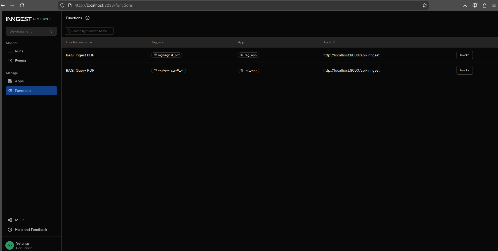

**Query Function Invocation:**
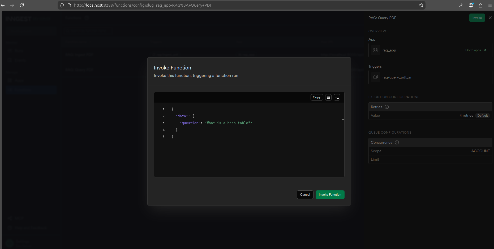

**Query Result with Answer:**
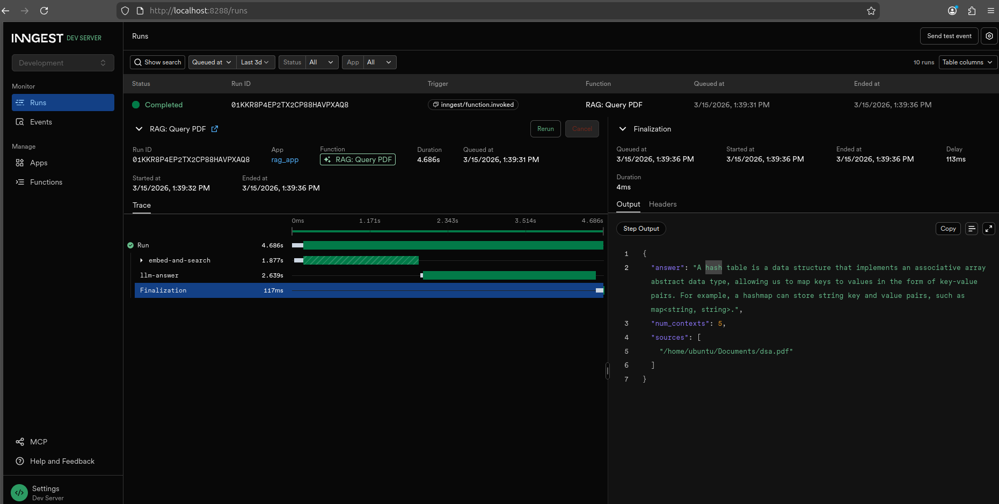

---

## 🔧 Step-by-Step Implementation

### Phase 1: Vector Database Setup

The **Qdrant vector database** stores all your documents as high-dimensional vectors, enabling fast semantic similarity search.

#### Step 1.1: Create Storage Directory

```bash
# Create folder for Qdrant persistent storage
mkdir qdrant_storage
```

This folder will store your vector database permanently, so data persists between runs.

#### Step 1.2: Start Qdrant with Docker

```bash
# For Windows/Mac/Linux with Docker
docker run -d --name qdrant-rag-db -p 6333:6333 -v "./qdrant_storage:/qdrant/storage" qdrant/qdrant
```

**Explanation:**

- `-d`: Run in background (daemon mode)
- `--name qdrant-rag-db`: Name of the container for reference
- `-p 6333:6333`: Expose Qdrant's port 6333 (maps container port to your machine)
- `-v "./qdrant_storage:/qdrant/storage"`: Mount local folder for data persistence
  - Left side: Your local folder
  - Right side: Container's internal folder
- `qdrant/qdrant`: The Docker image to run

**Verify it's running:**

```bash
docker ps  # Should show qdrant-rag-db running
```

**Docker Container Management Commands:**

```bash
# List all running containers
docker ps

# List all containers (including stopped ones)
docker ps -a

# Stop the Qdrant container
docker stop qdrant-rag-db

# Start the container again (if it was stopped)
docker start qdrant-rag-db

# Remove the container completely (deletes it)
docker rm qdrant-rag-db

# View container logs for debugging
docker logs qdrant-rag-db

# View real-time logs
docker logs -f qdrant-rag-db

# Get container statistics (CPU, memory usage)
docker stats qdrant-rag-db
```

**Common Docker Troubleshooting:**

| Problem                  | Solution                                                      |
| ------------------------ | ------------------------------------------------------------- |
| Port 6333 already in use | `docker stop qdrant-rag-db` then `docker start qdrant-rag-db` |
| Container not found      | Check with `docker ps -a` and create new one if needed        |
| Out of storage           | Check `qdrant_storage/` folder size                           |
| Can't connect to Qdrant  | Verify container is running: `docker ps`                      |
| Want to reset database   | Stop container, delete `qdrant_storage/` folder, restart      |

#### Step 1.3: Create Vector Database Client

Create file: `vector_db.py`

```python
from qdrant_client import QdrantClient
from qdrant_client.models import VectorParams, Distance, PointStruct


class QdrantStorage:
    """
    Manages vector storage and retrieval using Qdrant.

    Key Concepts:
    - Collections: Like tables in SQL, store vectors with metadata
    - Vectors: High-dimensional representations of text (3072 dimensions)
    - Payloads: Metadata stored with vectors (source, text, etc.)
    - Distance Metric: COSINE measures angle between vectors
      (good for semantic similarity)
    """

    def __init__(self, url="http://localhost:6333", collection="docs", dim=3072):
        """
        Initialize connection to Qdrant and create collection if needed.

        Args:
            url: Qdrant server URL (default: localhost on port 6333)
            collection: Name of the collection (like a table name)
            dim: Vector dimensions (3072 for text-embedding-3-large)
        """
        self.client = QdrantClient(url=url, timeout=30)
        self.collection = collection

        # Create collection if it doesn't exist
        if not self.client.collection_exists(self.collection):
            self.client.create_collection(
                collection_name=self.collection,
                vectors_config=VectorParams(size=dim, distance=Distance.COSINE),
            )

    def upsert(self, ids, vectors, payloads):
        """
        Insert or update vectors into the database.

        "Upsert" = insert if new, update if exists

        Args:
            ids: Unique identifiers for each chunk
            vectors: Embedding vectors (numerical representations)
            payloads: Metadata dictionaries {source, text, ...}
        """
        points = [
            PointStruct(id=ids[i], vector=vectors[i], payload=payloads[i]) 
            for i in range(len(ids))
        ]
        self.client.upsert(self.collection, points=points)

    def search(self, query_vector, top_k: int = 5):
        """
        Search for similar vectors and return matching documents.

        Semantic Search Process:
        1. Compare query vector against all stored vectors
        2. Find vectors with highest cosine similarity
        3. Return top_k matches with their payloads (text, source)

        Args:
            query_vector: Embedded question (3,072 floats)
            top_k: Number of results to return

        Returns:
            Dictionary with:
            - 'contexts': List of matching text chunks
            - 'sources': List of source file names
        """
        results = self.client.query_points(
            collection_name=self.collection,
            query=query_vector,
            with_payload=True,  # Include metadata
            limit=top_k
        )
        contexts = []
        sources = set()

        for r in results.points:
            payload = r.payload or {}
            text = payload.get("text", "")
            source = payload.get("source", "")
            if text:
                contexts.append(text)
                sources.add(source)

        return {"contexts": contexts, "sources": list(sources)}
```

---

### Phase 2: Data Processing (PDF Loading & Chunking)

Process PDFs: extract text, split into chunks, and convert to embeddings.

Create file: `data_loader.py`

```python
from dotenv import load_dotenv
from llama_index.core.node_parser import SentenceSplitter
from llama_index.readers.file import PDFReader
from openai import OpenAI

load_dotenv()

client = OpenAI()
EMBED_MODEL = "text-embedding-3-large"  # OpenAI's powerful embedding model
EMBED_DIM = 3072  # Fixed dimension size for this model

# Configure text splitter:
# - chunk_size=1000: Each chunk ~1000 characters (~200-250 words)
# - chunk_overlap=200: Overlap between chunks for context preservation
# Why overlap? If a concept spans two chunks, both will have it.
splitter = SentenceSplitter(chunk_size=1000, chunk_overlap=200)


def load_and_chunk_pdf(path: str):
    """
    Load a PDF file and split it into smaller, manageable chunks.

    Why Chunking?
    - PDFs can be 10,000+ pages
    - LLMs have token limits (context windows)
    - Smaller chunks improve search relevance
    - Overlap preserves context across chunk boundaries

    Args:
        path: File path to the PDF

    Returns:
        List of text chunks (strings)
    """
    # Use LlamaIndex to load PDF
    # This handles various PDF formats and encodings
    docs = PDFReader().load_data(file=path)

    # Extract text from documents
    texts = [d.text for d in docs if getattr(d, "text", None)]

    # Split each document into chunks
    chunks = []
    for t in texts:
        chunks.extend(splitter.split_text(t))

    return chunks


def embed_texts(texts: list[str]) -> list[list[float]]:
    """
    Convert text chunks into vector embeddings.

    What are Embeddings?
    - Convert text to a list of 3,072 numbers
    - Similar text produces similar embeddings
    - Used for semantic search (meaning-based matching)
    - Same model for questions and documents ensures compatibility

    Args:
        texts: List of text strings to embed

    Returns:
        List of embedding vectors (each is a list of 3,072 floats)
    """
    response = client.embeddings.create(
        model=EMBED_MODEL,
        input=texts,  # Can be a single string or list of strings
    )
    # Extract embeddings from response
    return [item.embedding for item in response.data]
```

---

### Phase 3: Define Data Types

Create file: `custom_types.py`

```python
import pydantic


class RAGChunkAndSrc(pydantic.BaseModel):
    """
    Represents chunked PDF data with source information.
    Used to pass data between Inngest steps.
    Pydantic validates types and provides helpful error messages.
    """
    chunks: list[str]  # List of text chunks from PDF
    source_id: str | None = None  # Name/identifier of the source PDF


class RAGUpsertResult(pydantic.BaseModel):
    """Result of inserting vectors into database."""
    ingested: int  # Number of chunks successfully ingested


class RAGSearchResult(pydantic.BaseModel):
    """Result of searching the vector database."""
    contexts: list[str]  # Retrieved text chunks
    sources: list[str]  # Source files these chunks came from


class RAGQueryResult(pydantic.BaseModel):
    """Final answer from the RAG pipeline."""
    answer: str  # Generated answer from LLM
    sources: list[str]  # Supporting document sources
    num_contexts: int  # Number of context chunks used
```

---

### Phase 4: Build the Backend with Inngest Orchestration

Create file: `main.py`

This is the core of your application. Here's the complete implementation with detailed comments:

```python
import logging
import os
import uuid

import inngest.fast_api
from dotenv import load_dotenv
from fastapi import FastAPI
from inngest import Inngest, TriggerEvent, Context, PydanticSerializer
from inngest.experimental import ai

from custom_types import RAGUpsertResult, RAGChunkAndSrc, RAGSearchResult
from data_loader import load_and_chunk_pdf, embed_texts
from vector_db import QdrantStorage

# Load environment variables from .env file
load_dotenv()

# ============================================================================
# INNGEST CLIENT SETUP
# ============================================================================
# Inngest handles:
# - Event routing: Which function to call for each event type
# - Automatic retries: 5 attempts by default for failed steps
# - Step tracking: Monitor each step separately with timing
# - Observability: Dashboard shows all executions, errors, and logs
# - Durable execution: Survives crashes and restarts

inngest_client = Inngest(
    app_id="rag_app",  # Unique ID for your application
    logger=logging.getLogger("uvicorn"),  # Use uvicorn's logger for consistency
    is_production=False,  # Development mode (no authentication required)
    serializer=PydanticSerializer(),  # Use Pydantic for type validation
)

# ============================================================================
# FUNCTION 1: INGEST PDF
# ============================================================================
# Handles complete PDF ingestion pipeline:
# 1. Load PDF from disk
# 2. Split into chunks
# 3. Generate embeddings
# 4. Store in vector database

@inngest_client.create_function(
    fn_id="RAG: Ingest PDF",
    trigger=TriggerEvent(event="rag/ingest_pdf")
)
async def rag_ingest_pdf(ctx: Context):
    """
    Orchestrated PDF ingestion function.

    Expected event data:
    {
        "pdf_path": "/path/to/file.pdf",
        "source_id": "optional_source_name"
    }

    Process:
    1. Load and chunk PDF → returns chunks list
    2. Embed chunks and store in Qdrant → returns ingestion count
    3. Inngest tracks each step with retries on failure
    """

    def _load(ctx: Context) -> RAGChunkAndSrc:
        """
        Step 1: Load and chunk the PDF
        """
        pdf_path = ctx.event.data["pdf_path"]
        source_id = ctx.event.data.get("source_id", pdf_path)
        chunks = load_and_chunk_pdf(pdf_path)
        return RAGChunkAndSrc(chunks=chunks, source_id=source_id)

    def _upsert(chunks_and_src: RAGChunkAndSrc) -> RAGUpsertResult:
        """
        Step 2: Embed chunks and store in database
        """
        chunks = chunks_and_src.chunks
        source_id = chunks_and_src.source_id

        # Generate embeddings for all chunks
        # OpenAI's API handles batching internally
        vecs = embed_texts(chunks)

        # Create unique IDs for each chunk
        # Format: UUID based on source name + position
        ids = [
            str(uuid.uuid5(uuid.NAMESPACE_URL, f"{source_id}:{i}")) 
            for i in range(len(chunks))
        ]

        # Create payloads (metadata to store with vectors)
        payloads = [
            {"source": source_id, "text": chunks[i]} 
            for i in range(len(chunks))
        ]

        # Store in Qdrant
        QdrantStorage().upsert(ids, vecs, payloads)
        return RAGUpsertResult(ingested=len(chunks))

    # Execute steps with Inngest's step.run()
    # This provides:
    # - Retry logic: automatically retries on failure
    # - Execution tracking: each step is tracked in dashboard
    # - Type safety: output types are validated

    chunks_and_src = await ctx.step.run(
        "load-and-chunk",
        lambda: _load(ctx),
        output_type=RAGChunkAndSrc
    )

    ingested = await ctx.step.run(
        "embed-and-upsert",
        lambda: _upsert(chunks_and_src),
        output_type=RAGUpsertResult
    )

    return ingested.model_dump()


# ============================================================================
# FUNCTION 2: QUERY PDF WITH AI
# ============================================================================
# Handles complete RAG pipeline:
# 1. Embed the question
# 2. Search for relevant documents
# 3. Send to LLM with context
# 4. Return answer with sources

@inngest_client.create_function(
    fn_id="RAG: Query PDF",
    trigger=TriggerEvent(event="rag/query_pdf_ai")
)
async def rag_query_pdf_ai(ctx: Context):
    """
    Orchestrated RAG query function.

    Expected event data:
    {
        "question": "Your question here",
        "top_k": 5  # Optional: number of results to retrieve
    }
    """

    def _search(question: str, top_k: int = 5) -> RAGSearchResult:
        """
        Step 1: Search vector database for relevant chunks
        """
        # Embed the question using same model as documents
        query_vec = embed_texts([question])[0]

        # Search Qdrant for similar vectors
        store = QdrantStorage()
        found = store.search(query_vec, top_k)

        return RAGSearchResult(contexts=found["contexts"], sources=found["sources"])

    # Extract data from event
    question = ctx.event.data["question"]
    top_k = int(ctx.event.data.get("top_k", 5))

    # Step 1: Search
    found = await ctx.step.run(
        "embed-and-search",
        lambda: _search(question, top_k),
        output_type=RAGSearchResult
    )

    # Step 2: Prepare context for LLM
    # Format retrieved chunks into a structured context block
    context_block = "\n\n".join(f"- {c}" for c in found.contexts)

    # Create the augmented prompt
    # This is the key to RAG: we're giving the LLM the retrieved context
    # so it can provide accurate, sourced answers
    user_content = (
        "Use the following context to answer the question.\n\n"
        f"Context:\n{context_block}\n\n"
        f"Question: {question}\n"
        "Answer concisely using the context above. "
        "If the answer is not in the context, say you don't know."
    )

    # Step 3: Send to LLM
    # Inngest's AI adapter handles LLM calls with proper error handling
    adapter = ai.openai.Adapter(
        auth_key=os.getenv("OPENAI_API_KEY"),
        model="gpt-4o-mini"  # Fast, cost-effective model
    )

    res = await ctx.step.ai.infer(
        "llm-answer",
        adapter=adapter,
        body={
            "max_tokens": 1024,  # Limit response length
            "temperature": 0.2,  # Lower = more factual, less creative
            "messages": [
                {
                    "role": "system",
                    "content": "You are a helpful assistant that answers questions using only the provided context."
                },
                {
                    "role": "user",
                    "content": user_content
                }
            ]
        }
    )

    # Extract and return the answer
    answer = res["choices"][0]["message"]["content"].strip()
    return {
        "answer": answer,
        "sources": found.sources,
        "num_contexts": len(found.contexts)
    }


# ============================================================================
# FASTAPI SETUP
# ============================================================================

app = FastAPI(
    title="RAG AI Agent",
    description="Production-ready PDF RAG application with Inngest orchestration"
)

# Serve Inngest functions through FastAPI
# This exposes the functions at /api/inngest endpoint
inngest.fast_api.serve(app, inngest_client, [rag_ingest_pdf, rag_query_pdf_ai])


@app.get("/health")
def health_check():
    """Simple health check endpoint for monitoring"""
    return {"status": "healthy"}
```

---

### Phase 5: Create the User Interface

Create file: `streamlit_app.py`

The Streamlit app provides a user-friendly interface for the RAG system. Here's what the UI looks like:

**PDF Upload Interface:**
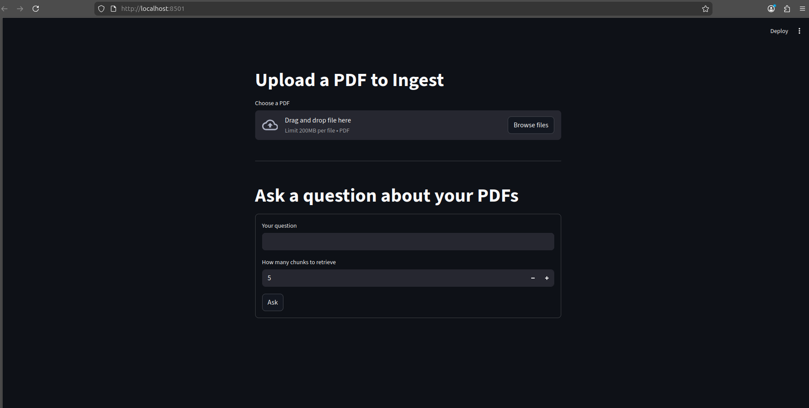

**Query and Answer Display:**
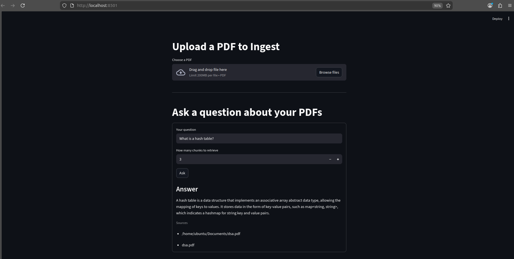

The complete implementation with detailed comments:

```python
import os
import time
from pathlib import Path

import inngest
import requests
import streamlit as st
from dotenv import load_dotenv

load_dotenv()

# Configure Streamlit page settings
st.set_page_config(
    page_title="RAG PDF Assistant",
    page_icon="📄",
    layout="centered"
)


@st.cache_resource
def get_inngest_client() -> inngest.Inngest:
    """
    Cache the Inngest client.
    Cache means this runs only once, then reuses the result.
    Improves performance across Streamlit sessions.
    """
    return inngest.Inngest(app_id="rag_app", is_production=False)


def save_uploaded_pdf(file) -> Path:
    """
    Save uploaded PDF to local uploads directory.

    Args:
        file: Streamlit uploaded file object

    Returns:
        Path object to saved file
    """
    uploads_dir = Path("uploads")
    uploads_dir.mkdir(parents=True, exist_ok=True)
    file_path = uploads_dir / file.name
    file_bytes = file.getbuffer()
    file_path.write_bytes(file_bytes)
    return file_path


def send_rag_ingest_event(pdf_path: Path) -> None:
    """
    Trigger PDF ingestion through Inngest.

    Sends an event to Inngest which will:
    1. Trigger the rag_ingest_pdf function
    2. Load and chunk the PDF
    3. Generate embeddings
    4. Store in Qdrant
    """
    client = get_inngest_client()
    client.send_sync(
        inngest.Event(
            name="rag/ingest_pdf",
            data={
                "pdf_path": str(pdf_path.resolve()),
                "source_id": pdf_path.name,
            },
        )
    )


# ============================================================================
# SECTION 1: PDF UPLOAD
# ============================================================================

st.title("📄 RAG PDF Assistant")
st.markdown("Upload PDFs and ask intelligent questions about their content!")

uploaded = st.file_uploader(
    "Choose a PDF to upload",
    type=["pdf"],
    accept_multiple_files=False
)

if uploaded is not None:
    with st.spinner("Processing PDF..."):
        path = save_uploaded_pdf(uploaded)
        send_rag_ingest_event(path)
        time.sleep(0.3)
    st.success(f"✅ Successfully ingested: {path.name}")
    st.caption(
        "The PDF has been added to the knowledge base. "
        "You can now ask questions about it!"
    )

st.divider()

# ============================================================================
# SECTION 2: QUERY
# ============================================================================

st.title("❓ Ask a Question")


def send_rag_query_event(question: str, top_k: int) -> str:
    """Send query event to Inngest and get event ID"""
    client = get_inngest_client()
    result = client.send_sync(
        inngest.Event(
            name="rag/query_pdf_ai",
            data={
                "question": question,
                "top_k": top_k,
            },
        )
    )
    return result[0]


def _inngest_api_base() -> str:
    """Get Inngest API base URL from environment or use default"""
    return os.getenv("INNGEST_API_BASE", "http://127.0.0.1:8288/v1")


def fetch_runs(event_id: str) -> list[dict]:
    """Fetch function runs from Inngest API"""
    url = f"{_inngest_api_base()}/events/{event_id}/runs"
    resp = requests.get(url)
    resp.raise_for_status()
    data = resp.json()
    return data.get("data", [])


def wait_for_run_output(
    event_id: str,
    timeout_s: float = 120.0,
    poll_interval_s: float = 0.5
) -> dict:
    """
    Poll Inngest API until function completes.

    This waits for the background function to complete
    and returns the result.
    """
    start = time.time()
    last_status = None
    while True:
        runs = fetch_runs(event_id)
        if runs:
            run = runs[0]
            status = run.get("status")
            last_status = status or last_status
            if status in ("Completed", "Succeeded", "Success", "Finished"):
                return run.get("output") or {}
            if status in ("Failed", "Cancelled"):
                raise RuntimeError(f"Function run {status}")
        if time.time() - start > timeout_s:
            raise TimeoutError(f"Timed out waiting (last status: {last_status})")
        time.sleep(poll_interval_s)


# Query form
with st.form("rag_query_form"):
    question = st.text_input("📝 Your question:")
    top_k = st.slider(
        "📊 Number of relevant chunks to retrieve:",
        min_value=1,
        max_value=20,
        value=5
    )
    submitted = st.form_submit_button("🚀 Ask")

    if submitted and question.strip():
        with st.spinner("Searching and generating answer..."):
            try:
                # Send event and wait for result
                event_id = send_rag_query_event(question.strip(), int(top_k))
                output = wait_for_run_output(event_id)
                answer = output.get("answer", "")
                sources = output.get("sources", [])

                # Display results
                st.subheader("💡 Answer")
                st.write(answer or "(No answer generated)")

                if sources:
                    st.subheader("📚 Sources")
                    for source in sources:
                        st.write(f"- **{source}**")

            except TimeoutError:
                st.error("⏱️ Request timed out. Please try again.")
            except Exception as e:
                st.error(f"❌ Error: {str(e)}")
```

---

## 🚀 Running the Application

### Prerequisites Check

Make sure you have:

1. ✅ Python 3.12+ installed
2. ✅ Node.js installed
3. ✅ Docker installed and running
4. ✅ OpenAI API key in `.env` file
5. ✅ Qdrant running (`docker ps` should show qdrant-rag-db)

### Step 1: Start Qdrant Vector Database

```bash
# If not already running
docker run -d --name qdrant-rag-db -p 6333:6333 -v "./qdrant_storage:/qdrant/storage" qdrant/qdrant
```

### Step 2: Start the FastAPI Backend

In terminal 1:

```bash
uv run uvicorn main:app --reload
```

You should see:

```
INFO:     Uvicorn running on http://127.0.0.1:8000
INFO:     Application startup complete
```

### Step 3: Start Inngest Development Server

In terminal 2:

```bash
npx inngest-cli@latest dev -u http://127.0.0.1:8000/api/inngest --no-discovery
```

You should see:

```
Inngest Dev Server online at 0.0.0.0:8288
```

Visit http://localhost:8288 to see the Inngest dashboard!

**Inngest Dev Server Dashboard:**
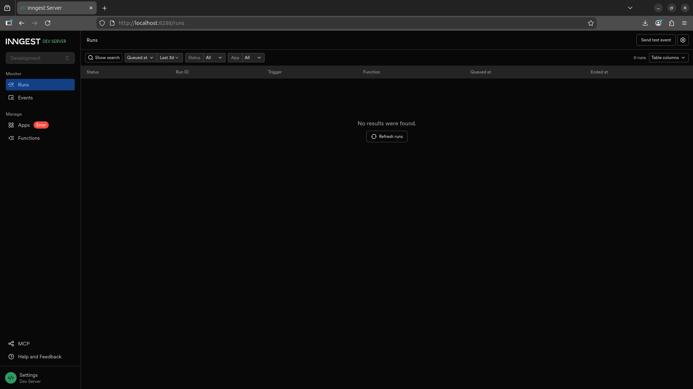

### Step 4: Start the Streamlit Frontend

In terminal 3:

```bash
uv run streamlit run streamlit_app.py
```

You should see:

```
You can now view your Streamlit app in your browser at: http://localhost:8501
```

### Step 5: Use the Application

1. Open http://localhost:8501 in your browser
2. Upload a PDF file
3. Ask questions about its content
4. Check the Inngest dashboard (http://localhost:8288) to see function executions

---

## 📊 Understanding the Inngest Dashboard

The Inngest dashboard at http://localhost:8288 shows:

### Apps Section

- Lists all registered applications
- Shows function names for each app

**App Page View:**
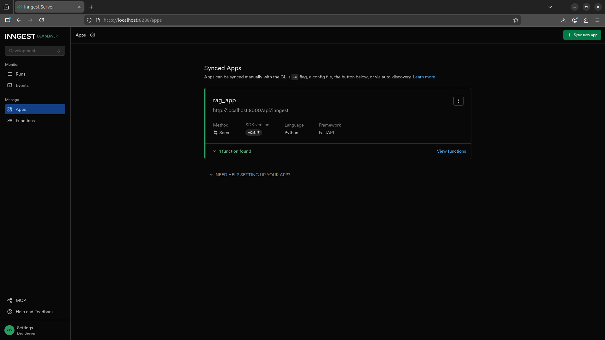

### Functions Section

- Lists all Inngest functions
- Shows execution count and status

**View Functions Page:**
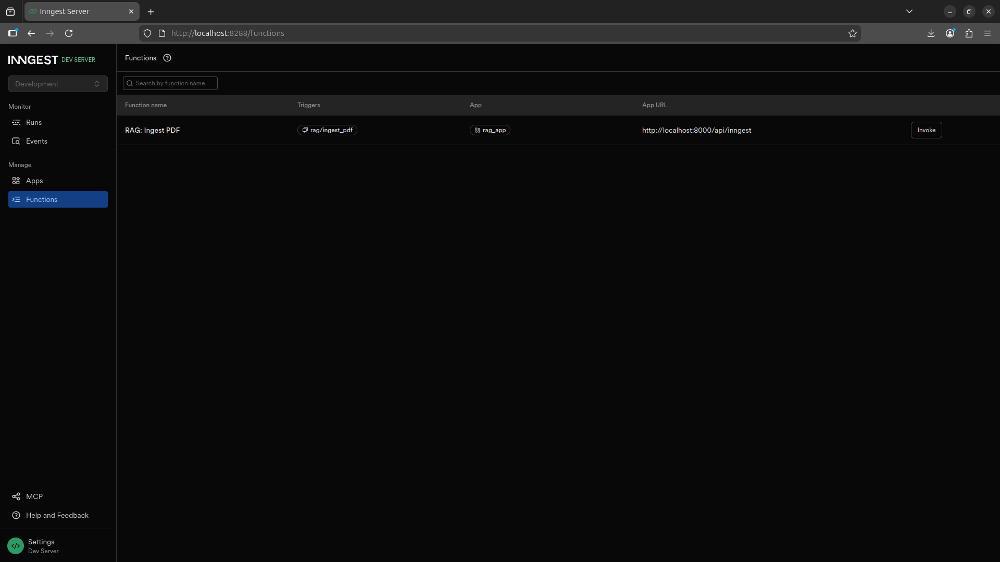

### Runs Section

- Shows every function execution
- Displays execution time and status
- Click to see detailed logs and output

**Function Execution Output:**
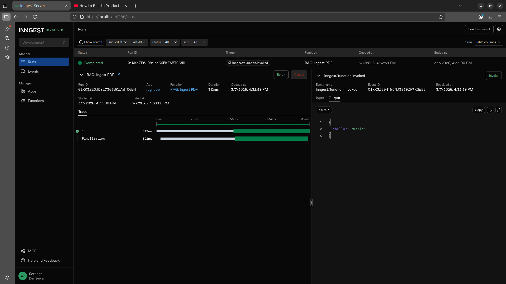

### Key Features

- **Retry Tracking**: See how many times a step was retried
- **Error Details**: Click into failed steps to see error messages
- **Step Breakdown**: View timing for each step (load, embed, search, etc.)
- **Event Details**: See the input data that triggered the function

---

## 🧪 Testing the Application

### Manual Testing in Inngest Dashboard

1. Go to Inngest dashboard (http://localhost:8288)

2. Find "RAG: Ingest PDF" function

3. Click "Invoke" button

4. Enter test data:
   
   ```json
   {
   "pdf_path": "/path/to/your/test.pdf",
   "source_id": "test-pdf"
   }
   ```

**Invoke Function Prompt:**
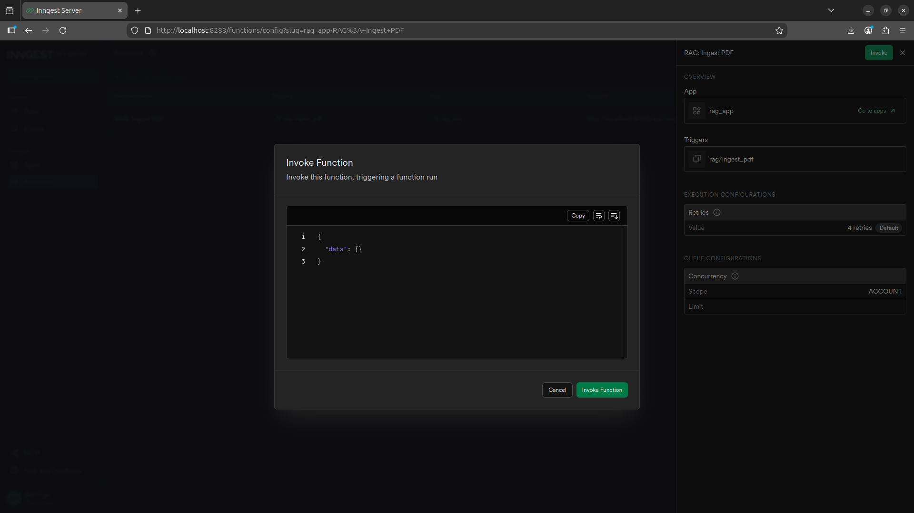

5. Click "Invoke Function"

**Function Invocation Result:**
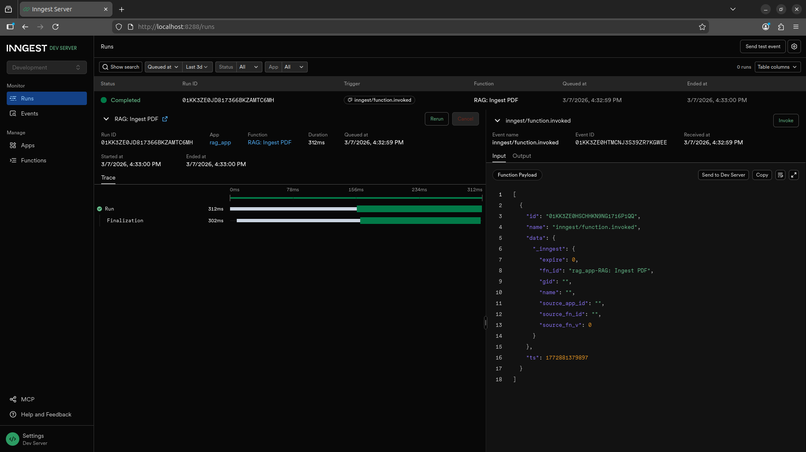

6. Watch execution in Runs tab

**PDF Ingestion with Results:**
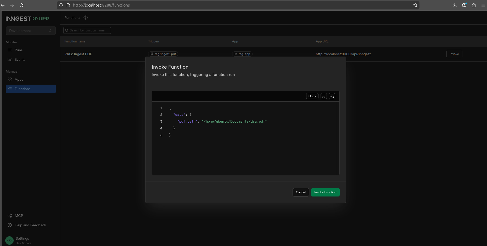

**Execution Runs:**
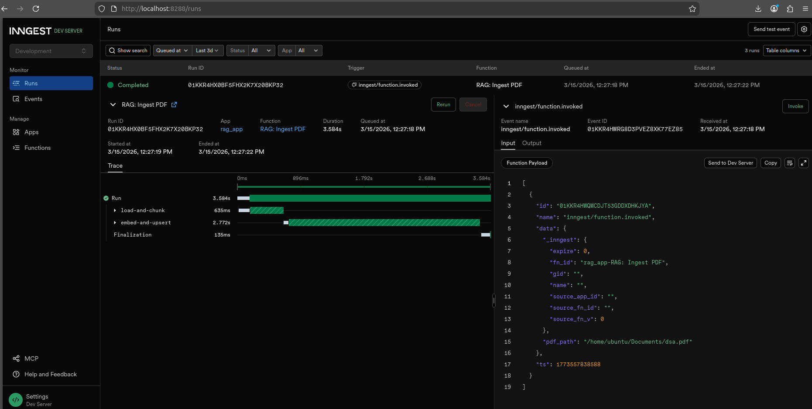

**Step-by-Step Method Outputs:**
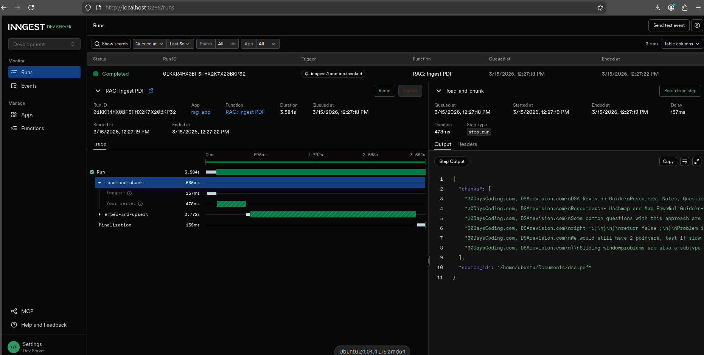

### Testing with Streamlit UI

1. Open http://localhost:8501 in your browser

**Streamlit App Interface:**


2. Upload a PDF via the Streamlit UI
3. Wait for success message
4. Ask a question
5. Check Inngest dashboard for function execution

**Question Answered with Sources:**


---

## 🐛 Troubleshooting

### "Connection refused" error when starting backend

- Make sure Qdrant is running: `docker ps` should show qdrant-rag-db
- If not running: `docker start qdrant-rag-db`

### Inngest dashboard shows 404 errors

- Check backend is running: http://localhost:8000/health should return `{"status":"healthy"}`
- Verify Inngest can reach your API URL

### PDF ingestion seems slow

- This is normal! Each PDF chunk is embedded using OpenAI API
- First request has some latency
- Check Inngest dashboard for exact timing per step

### Questions not being answered

- Check that PDF was successfully ingested (Inngest dashboard)
- Try asking more specific questions related to the document content
- Check retrieved context in Inngest dashboard to see what was found

---

## 📚 Project Structure

```
rag-ai-agent/
├── main.py                 # FastAPI backend + Inngest functions
├── streamlit_app.py        # Frontend UI
├── vector_db.py            # Qdrant database client
├── data_loader.py          # PDF loading and chunking
├── custom_types.py         # Pydantic data models
├── .env                    # Environment variables (OPENAI_API_KEY)
├── pyproject.toml          # Project dependencies
├── qdrant_storage/         # Vector database storage (created by Docker)
├── uploads/                # Uploaded PDFs (created by app)
└── README.md               # This file!
```

---

## 🎓 Key Learnings

### What This Project Teaches You

1. **RAG Architecture**: How to build production-grade RAG systems
2. **Vector Databases**: Using Qdrant for semantic search
3. **Event-Driven Architecture**: With Inngest orchestration
4. **PDF Processing**: Loading and chunking documents
5. **LLM Integration**: Using OpenAI API reliably
6. **Production Patterns**: Retries, logging, monitoring
7. **Full-Stack AI**: Frontend + Backend + Database

### Beyond This Project

- Try different chunking strategies
- Experiment with different embedding models
- Add filters (date, document type, etc.)
- Implement user authentication
- Deploy to production (AWS, GCP, Azure, etc.)
- Try other LLMs (Claude, Llama, etc.)

---

## 📝 License

This project is open source and available under the MIT License.

---

## 🤝 Contributing

Feel free to fork, modify, and improve this project!

---

## 📞 Support

If you encounter issues:

1. Check the Inngest dashboard for function errors
2. Review the logs in the terminal
3. Ensure all prerequisites are installed
4. Check that services (Qdrant, FastAPI, Streamlit) are running

Happy building! 🚀
